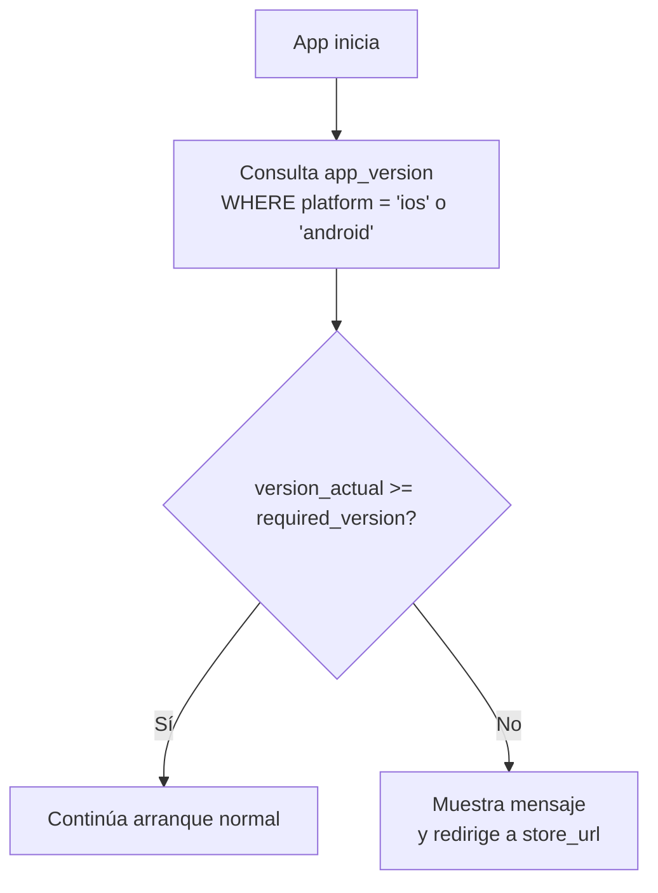
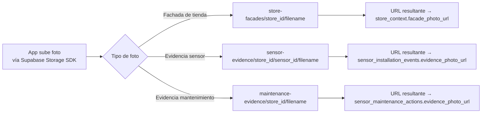

# App Version & Storage

Este documento cubre la tabla `app_version` para control de versiones de la aplicación móvil, y los buckets de almacenamiento de archivos multimedia usados por el flujo de instalación.

---

## Tabla `public.app_version`

Tabla de control de versiones mínimas requeridas por plataforma. El frontend consulta esta tabla al iniciar para verificar si necesita actualizarse.

### Columnas

| Columna | Tipo | Auto | Notas |
|---|---|---|---|
| `id` | `uuid` | `gen_random_uuid()` | PK |
| `platform` | `varchar(20)` | — | Solo `'android'` o `'ios'`. UNIQUE |
| `required_version` | `varchar(20)` | — | Versión mínima requerida (ej. `"2.1.0"`) |
| `message` | `text` | — | Mensaje opcional para mostrar al usuario al forzar actualización |
| `store_url` | `text` | — | URL de la tienda de apps para la plataforma |
| `updated_at` | `timestamptz` | `NOW()` | Última actualización |

### Constraints

| Constraint | Regla |
|---|---|
| `app_version_pkey` | PK sobre `id` |
| `unique_platform` | Una sola fila por plataforma |
| `app_version_platform_check` | `platform IN ('android', 'ios')` |

### Índices

`idx_app_version_platform` (btree sobre `platform`).

**RLS:** habilitado. Sin políticas directas definidas en schemas.

### Uso típico en el frontend



> **Nota:** el frontend no tiene acceso directo a esta tabla vía RLS. Si se necesita exponer este dato, debe hacerse a través de un RPC o función SECURITY DEFINER.

---

## Storage Buckets

Se definen tres buckets privados en `storage.buckets`. Todos son **privados** (`public = false`).

### Buckets disponibles

| Bucket ID | Nombre | Propósito |
|---|---|---|
| `store-facades` | `store-facades` | Fotos de fachada de tiendas |
| `sensor-evidence` | `sensor-evidence` | Evidencias fotográficas de instalaciones de sensores |
| `maintenance-evidence` | `maintenance-evidence` | Evidencias fotográficas de acciones de mantenimiento |

---

### Políticas de acceso (storage.objects)

Todas las políticas están sobre la tabla `storage.objects` y aplican a usuarios con rol `authenticated`.

#### `store-facades`

| Operación | Política | Condición |
|---|---|---|
| SELECT | `installer_store_facades_objects_select` | `bucket_id = 'store-facades'` |
| INSERT | `installer_store_facades_objects_insert` | `bucket_id = 'store-facades'` |
| UPDATE | `installer_store_facades_objects_update` | `bucket_id = 'store-facades'` |
| DELETE | `installer_store_facades_objects_delete` | `bucket_id = 'store-facades'` |

#### `sensor-evidence`

| Operación | Política | Condición |
|---|---|---|
| SELECT | `installer_sensor_evidence_objects_select` | `bucket_id = 'sensor-evidence'` |
| INSERT | `installer_sensor_evidence_objects_insert` | `bucket_id = 'sensor-evidence'` |
| UPDATE | `installer_sensor_evidence_objects_update` | `bucket_id = 'sensor-evidence'` |
| DELETE | `installer_sensor_evidence_objects_delete` | `bucket_id = 'sensor-evidence'` |

#### `maintenance-evidence`

| Operación | Política | Condición |
|---|---|---|
| SELECT | `installer_maintenance_evidence_objects_select` | `bucket_id = 'maintenance-evidence'` |
| INSERT | `installer_maintenance_evidence_objects_insert` | `bucket_id = 'maintenance-evidence'` |
| UPDATE | `installer_maintenance_evidence_objects_update` | `bucket_id = 'maintenance-evidence'` |
| DELETE | `installer_maintenance_evidence_objects_delete` | `bucket_id = 'maintenance-evidence'` |

---

### Flujo de subida de archivos



---

## Restricciones para el frontend

| Acción | Permitido | Notas |
|---|---|---|
| Subir foto de fachada | ✅ | Cualquier usuario `authenticated` |
| Subir evidencia de sensor | ✅ | Cualquier usuario `authenticated` |
| Subir evidencia de mantenimiento | ✅ | Cualquier usuario `authenticated` |
| Acceder a fotos de otros | ✅ | La política no segmenta por usuario; cualquier `authenticated` puede leer todos los objetos |
| Buckets públicos sin autenticación | ❌ | Todos los buckets son privados |
| Leer `app_version` directamente | ❌ | RLS habilitado sin políticas públicas; usar RPC si se necesita |
| Modificar `app_version` | ❌ | Solo `service_role` o admin de consola |

---

## Enums globales definidos en `000_init.sql`

Estos tipos están disponibles en todo el schema y son referenciados por múltiples tablas y RPCs:

### `public.sensor_install_status`

```
detected | connecting | config_sending | config_sent | confirming | installed | failed | cancelled | uninstalled
```

Ver documentación completa en [sensors.md](./sensors.md).

### `public.store_detail_include`

```
context | metadata
```

Enum auxiliar para inclusión de detalles opcionales en consultas (no expuesto directamente como parámetro en RPCs actuales documentados).

### `public.store_install_session_status`

```
open | completed | cancelled
```

Usado en `store_installation_sessions` y `store_maintenance_sessions`.

### `public.user_active_session_type`

```
install | maintenance
```

Usado en el retorno de `rpc_user_active_session`.
