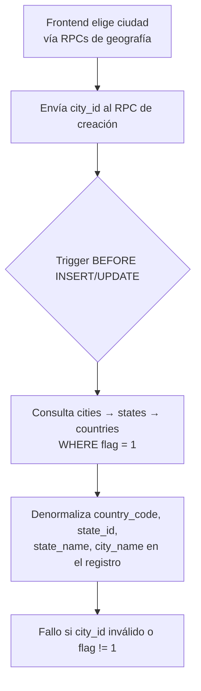

# Geography

Catálogo geográfico de solo-lectura que sirve como fuente canónica de verdad para validar y denormalizar ubicaciones en `stores` y `profiles`. Los datos provienen de la fuente **Rapid API GeoDB Cities** y son gestionados fuera del ciclo de vida de la aplicación.

---

## Modelo de datos

```mermaid
erDiagram
    regions {
        bigint id PK "IDENTITY"
        varchar(100) name
        text translations "JSON multilingüe"
        timestamp created_at
        timestamp updated_at
        smallint flag "1 = activo"
        varchar(255) wikiDataId
    }
    subregions {
        bigint id PK "IDENTITY"
        varchar(100) name
        text translations
        bigint region_id FK
        timestamp created_at
        timestamp updated_at
        smallint flag
        varchar(255) wikiDataId
    }
    countries {
        bigint id PK "IDENTITY"
        varchar(100) name
        char(3) iso3
        char(2) iso2 "código principal"
        varchar phonecode
        varchar capital
        varchar currency
        bigint region_id FK
        bigint subregion_id FK
        numeric(10-8) latitude
        numeric(11-8) longitude
        text google_maps_url "GENERATED"
        timestamp updated_at
        smallint flag
    }
    states {
        bigint id PK "IDENTITY"
        varchar(255) name
        bigint country_id FK
        char(2) country_code
        varchar iso2
        varchar iso3166_2
        varchar type "region / municipality / etc"
        integer level
        bigint parent_id
        numeric latitude
        numeric longitude
        varchar timezone "IANA tz"
        text google_maps_url "GENERATED"
        timestamp updated_at
        smallint flag
    }
    cities {
        bigint id PK "IDENTITY"
        varchar(255) name
        bigint state_id FK
        varchar state_code
        bigint country_id FK
        char(2) country_code
        varchar type
        integer level
        bigint parent_id
        numeric(10-8) latitude
        numeric(11-8) longitude
        varchar timezone "IANA tz"
        text google_maps_url "GENERATED"
        timestamp updated_at
        smallint flag
    }

    regions ||--o{ subregions : "tiene"
    subregions ||--o{ countries : "agrupa"
    regions ||--o{ countries : "pertenece"
    countries ||--o{ states : "contiene"
    states ||--o{ cities : "contiene"
```

---

## Tablas

### `public.regions`

Macro-regiones del mundo (África, Américas, Asia, Europa, Oceanía, Polar).

| Columna | Tipo | Notas |
|---|---|---|
| `id` | `bigint` | PK, generado por identidad (GENERATED BY DEFAULT AS IDENTITY) |
| `name` | `varchar(100)` | Nombre en inglés |
| `translations` | `text` | JSON con traducciones por locale (`{"es": "...", "fr": "..."}`) |
| `created_at` | `timestamp` | Sin timezone |
| `updated_at` | `timestamp` | DEFAULT `CURRENT_TIMESTAMP` |
| `flag` | `smallint` | `1` = activo. **Solo registros con `flag = 1` son expuestos por los RPCs.** |
| `wikiDataId` | `varchar(255)` | Referencia Wikidata |

**RLS:** habilitado. Sin políticas definidas en schemas (catálogo de solo lectura vía RPC).

---

### `public.subregions`

Subdivisiones dentro de una región (ej. "América del Sur", "Europa del Norte").

| Columna | Tipo | Notas |
|---|---|---|
| `id` | `bigint` | PK, IDENTITY |
| `name` | `varchar(100)` | |
| `translations` | `text` | JSON multilingüe |
| `region_id` | `bigint` | FK → `regions.id` |
| `updated_at` | `timestamp` | DEFAULT `CURRENT_TIMESTAMP` |
| `flag` | `smallint` | `1` = activo |
| `wikiDataId` | `varchar(255)` | |

**Índices:** `subregions_region_id_idx` (btree sobre `region_id`).

---

### `public.countries`

Países del mundo con datos geopolíticos completos.

| Columna | Tipo | Notas |
|---|---|---|
| `id` | `bigint` | PK, IDENTITY |
| `name` | `varchar(100)` | |
| `iso2` | `char(2)` | Código ISO-3166 alpha-2. **Usado como FK en `stores.country_code` y `profiles.country_code`** |
| `iso3` | `char(3)` | ISO-3166 alpha-3 |
| `numeric_code` | `char(3)` | |
| `phonecode` | `varchar` | |
| `capital` | `varchar` | |
| `currency` | `varchar` | |
| `region_id` | `bigint` | FK → `regions.id` |
| `subregion_id` | `bigint` | FK → `subregions.id` |
| `latitude` / `longitude` | `numeric` | Centroide del país |
| `google_maps_url` | `text` | **Campo GENERATED**: construido dinámicamente sobre `latitude`/`longitude` en las consultas RPC |
| `flag` | `smallint` | `1` = activo |

**Índices:** `countries_region_id_idx`, `countries_subregion_id_idx`.

---

### `public.states`

Estados, provincias o regiones administrativas dentro de un país.

| Columna | Tipo | Notas |
|---|---|---|
| `id` | `bigint` | PK, IDENTITY |
| `name` | `varchar(255)` | |
| `country_id` | `bigint` | FK → `countries.id` |
| `country_code` | `char(2)` | Denormalizado del país |
| `iso2` | `varchar` | Código ISO del estado (puede ser NULL; en ese caso se usa `id::TEXT` como código) |
| `iso3166_2` | `varchar(10)` | |
| `type` | `varchar(191)` | "region", "municipality", "administration", etc |
| `level` | `integer` | Nivel jerárquico |
| `parent_id` | `bigint` | Auto-referencia para jerarquías |
| `latitude` / `longitude` | `numeric` | |
| `timezone` | `varchar` | Identificador IANA (ej. `America/Mexico_City`) |
| `google_maps_url` | `text` | Generado en RPCs |
| `flag` | `smallint` | `1` = activo |

**Índices:** `states_country_id_idx`.

---

### `public.cities`

Ciudades y localidades dentro de un estado.

| Columna | Tipo | Notas |
|---|---|---|
| `id` | `bigint` | PK, IDENTITY. **Es el `city_id` usado en `stores`, `profiles`, y todos los RPCs de creación.** |
| `name` | `varchar(255)` | |
| `state_id` | `bigint` | FK → `states.id` |
| `state_code` | `varchar` | Denormalizado |
| `country_id` | `bigint` | FK → `countries.id` |
| `country_code` | `char(2)` | Denormalizado |
| `latitude` / `longitude` | `numeric` | |
| `timezone` | `varchar` | IANA timezone |
| `google_maps_url` | `text` | Generado en RPCs |
| `flag` | `smallint` | `1` = activo |

**Índices:** `cities_state_id_idx`, `cities_country_id_idx`.

---

## Flujo de uso geográfico

El `city_id` es el **único dato geográfico que el frontend debe proveer**. A partir de él, los triggers en `stores` y `profiles` resuelven y denormalizan automáticamente `country_code`, `state_id`, `state_name`, `city_name`, etc.

---

## RPCs de Geografía

Todos estos RPCs son de **solo lectura** (`STABLE`). Solo retornan registros con `flag = 1`.

### `rpc_geo_list_regions()`

Lista todas las regiones del mundo.

**Parámetros:** ninguno.

**Retorna:**

| Campo | Tipo |
|---|---|
| `region_id` | `bigint` |
| `region_name` | `text` |

**Permisos:** `authenticated`, `service_role`.

**Restricciones frontend:**
- No requiere parámetros.
- Siempre retorna las 6 regiones activas (flag=1).

---

### `rpc_geo_list_subregions(p_region_id)`

Lista subregiones, opcionalmente filtradas por región.

**Parámetros:**

| Parámetro | Tipo | Requerido | Notas |
|---|---|---|---|
| `p_region_id` | `bigint` | No | Si NULL, retorna todas |

**Retorna:** `subregion_id`, `region_id`, `subregion_name`.

**Permisos:** `authenticated`, `service_role`.

---

### `rpc_geo_list_countries(p_region_id, p_subregion_id)`

Lista países, con filtros opcionales por región y/o subregión.

**Parámetros:**

| Parámetro | Tipo | Requerido | Notas |
|---|---|---|---|
| `p_region_id` | `bigint` | No | Filtro opcional |
| `p_subregion_id` | `bigint` | No | Filtro opcional |

**Retorna:** `country_id`, `country_code` (iso2), `country_name`, `region_id`, `region_name`, `subregion_id`, `subregion_name`, `latitude`, `longitude`, `google_maps_url`.

**Permisos:** `authenticated`, `service_role`.

---

### `rpc_geo_list_states(p_country_id)`

Lista estados/provincias de un país. **Parámetro obligatorio.**

**Parámetros:**

| Parámetro | Tipo | Requerido | Error si falta |
|---|---|---|---|
| `p_country_id` | `bigint` | **Sí** | retorna vacío (no hay default) |

**Retorna:** `state_id`, `state_code`, `state_name`, `country_id`, `country_code`, `latitude`, `longitude`, `google_maps_url`.

> **Nota:** `state_code` es `iso2` del estado cuando existe, de lo contrario es `state_id::TEXT`.

**Permisos:** `authenticated`, `service_role`.

---

### `rpc_geo_list_cities(p_country_id, p_state_id)`

Lista ciudades de un estado dentro de un país. **Ambos parámetros son obligatorios.**

**Parámetros:**

| Parámetro | Tipo | Requerido | Notas |
|---|---|---|---|
| `p_country_id` | `bigint` | **Sí** | |
| `p_state_id` | `bigint` | **Sí** | |

**Retorna:** `city_id`, `city_code` (= `city_id::TEXT`), `city_name`, `state_id`, `country_id`, `latitude`, `longitude`, `google_maps_url`.

> El `city_id` retornado es el valor que se debe usar en todos los RPCs de creación de stores y perfiles.

**Permisos:** `authenticated`, `service_role`.

---

## Restricciones para el frontend

| Acción | Permitido | Notas |
|---|---|---|
| Leer regiones/subregiones/países/estados/ciudades | ✅ | Solo vía RPCs, no acceso directo a tablas |
| Crear/modificar registros geográficos | ❌ | Catálogo de solo lectura; gestionado externamente |
| Pasar `country_code` o `state_id` directamente en creación de store/profile | ❌ | Solo se acepta `city_id`; los demás campos se derivan automáticamente |
| Usar `city_id` con `flag = 0` | ❌ | El trigger lanzará excepción `invalid city_id` |
