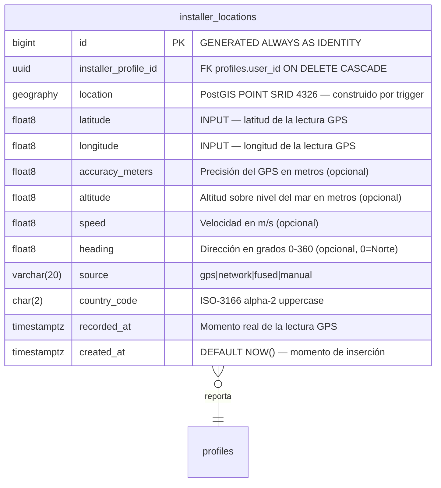
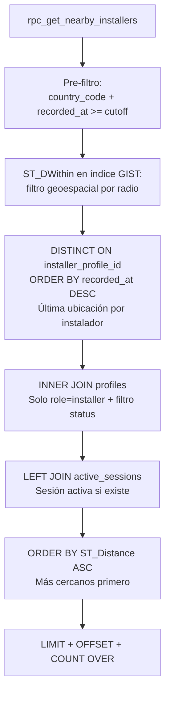
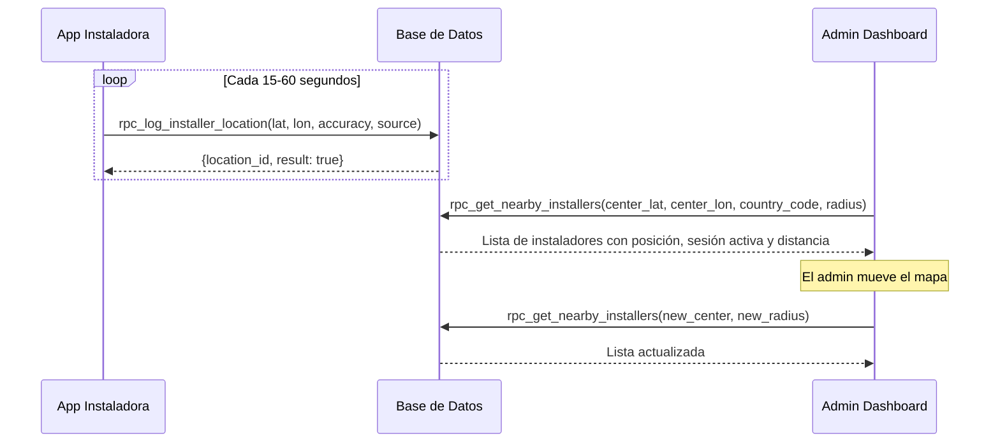

# Installer Locations

El dominio de ubicaciones de instaladores gestiona el tracking GPS en tiempo real de los instaladores desde la app móvil. Los datos se almacenan en una tabla append-only optimizada para consultas geoespaciales, y se exponen al Admin Dashboard a través de un RPC de búsqueda por radio.

---

## Modelo de datos



---

## Tabla `public.installer_locations`

Tabla de log **append-only** (nunca se actualiza ni borra individualmente). Cada fila es una lectura GPS en un momento dado. Diseñada para:

1. **Última posición conocida**: `DISTINCT ON (installer_profile_id) ORDER BY recorded_at DESC`
2. **Búsqueda geoespacial**: `ST_DWithin` sobre índice GIST
3. **Historial de movimiento**: trazabilidad para auditoría

### Columnas

| Columna | Tipo | Notas |
|---|---|---|
| `id` | `bigint` | PK. GENERATED ALWAYS AS IDENTITY |
| `installer_profile_id` | `uuid` | FK → `profiles.user_id` ON DELETE CASCADE |
| `location` | `extensions.geography(POINT,4326)` | Construido automáticamente desde `latitude`/`longitude` vía trigger. **No enviar directo** |
| `latitude` | `float8` | Rango -90..90. Requerido |
| `longitude` | `float8` | Rango -180..180. Requerido |
| `accuracy_meters` | `float8` | Precisión del GPS. `0` = exacto. Opcional |
| `altitude` | `float8` | Metros sobre nivel del mar. Opcional |
| `speed` | `float8` | Velocidad en m/s. Opcional |
| `heading` | `float8` | Dirección de movimiento en grados (0-360, 0=Norte). Opcional |
| `source` | `varchar(20)` | Ver valores permitidos. DEFAULT `'gps'` |
| `country_code` | `char(2)` | ISO-3166 alpha-2 uppercase. Requerido |
| `recorded_at` | `timestamptz` | Momento real de la lectura GPS (puede diferir de `created_at` si la app envió en cola offline) |
| `created_at` | `timestamptz` | Momento de inserción. DEFAULT `NOW()` |

### Valores permitidos: `source`

| Valor | Descripción |
|---|---|
| `gps` | GPS nativo del dispositivo |
| `network` | Triangulación por torres celulares o WiFi |
| `fused` | Fusión de fuentes por el OS (ej. Google Fused Location) |
| `manual` | Coordenada forzada manualmente |

### Constraints

| Constraint | Regla |
|---|---|
| `installer_locations_latitude_range_chk` | `latitude BETWEEN -90 AND 90` |
| `installer_locations_longitude_range_chk` | `longitude BETWEEN -180 AND 180` |
| `installer_locations_accuracy_non_negative_chk` | `accuracy_meters IS NULL OR accuracy_meters >= 0` |
| `installer_locations_speed_non_negative_chk` | `speed IS NULL OR speed >= 0` |
| `installer_locations_heading_range_chk` | `heading IS NULL OR (heading >= 0 AND heading < 360)` |
| `installer_locations_source_allowed_chk` | Solo `gps`, `network`, `fused`, `manual` |
| `installer_locations_country_code_format_chk` | `country_code ~ '^[A-Z]{2}$'` |
| `installer_locations_recorded_not_future_chk` | `recorded_at <= NOW() + INTERVAL '5 minutes'` (tolerancia de reloj) |

### Índices

| Índice | Tipo | Uso |
|---|---|---|
| `installer_locations_location_gist_idx` | GIST | `ST_DWithin` en `rpc_get_nearby_installers` |
| `installer_locations_installer_latest_idx` | btree `(installer_profile_id, recorded_at DESC)` | `DISTINCT ON` para última posición por instalador |
| `installer_locations_country_recorded_idx` | btree `(country_code, recorded_at DESC)` | Pre-filtro por país antes de la búsqueda espacial |
| `installer_locations_created_at_idx` | btree `(created_at)` | Jobs de purga |

---

## Trigger

### `trg_installer_locations_set_geography` → `fn_installer_locations_set_geography()`

**Evento:** `BEFORE INSERT` en `installer_locations`.

**Lógica:** Construye el campo `location` (geography POINT) desde `latitude` y `longitude`. El RPC solo inserta las coordenadas numéricas; el trigger se encarga del tipo PostGIS.

```sql
NEW.location := extensions.ST_SetSRID(
    extensions.ST_MakePoint(NEW.longitude, NEW.latitude), 4326
)::extensions.geography;
```

---

## RPC `rpc_log_installer_location(...)`

RPC que la app móvil llama periódicamente para reportar la ubicación GPS del instalador autenticado. Diseñado para alta frecuencia con bajo costo.

**Permisos:** `authenticated` (solo `installer` activo), `service_role`.

**Parámetros:**

| Parámetro | Tipo | Requerido | Default | Notas |
|---|---|---|---|---|
| `p_latitude` | `float8` | **Sí** | — | Rango -90..90 |
| `p_longitude` | `float8` | **Sí** | — | Rango -180..180 |
| `p_accuracy_meters` | `float8` | No | `NULL` | Precisión en metros |
| `p_altitude` | `float8` | No | `NULL` | Metros sobre nivel del mar |
| `p_speed` | `float8` | No | `NULL` | Velocidad en m/s |
| `p_heading` | `float8` | No | `NULL` | Dirección 0-360° |
| `p_source` | `text` | No | `'gps'` | `gps`, `network`, `fused`, `manual` |
| `p_country_code` | `text` | No | `NULL` | Si NULL, usa el `country_code` del perfil del instalador |
| `p_recorded_at` | `timestamptz` | No | `NOW()` | Timestamp real de la lectura (útil para envíos en cola offline) |
| `p_installer_profile_id` | `uuid` | Condicional | `NULL` | **Solo para `service_role`/consola.** Ignorado cuando lo llama un usuario autenticado |

**Retorna:**

| Campo | Tipo | Notas |
|---|---|---|
| `location_id` | `bigint` | ID del registro insertado |
| `result` | `boolean` | `true` si éxito |
| `error` | `text` | `NULL` si éxito |

**Restricciones frontend:**
- Solo perfiles con `role = 'installer'` y `status = 'active'` pueden reportar.
- `p_recorded_at` no puede ser más de 5 minutos en el futuro (tolerancia de reloj del dispositivo).
- El campo `location` se construye automáticamente; no enviarlo.
- Si `p_country_code` no se envía, se usa el del perfil (recomendado en la primera llamada de sesión, luego la app puede cachearlo).

**Frecuencia recomendada:**

| Estado de la app | Frecuencia sugerida |
|---|---|
| Sesión activa (instalando / mantenimiento) | Cada 15-30 segundos |
| App abierta sin sesión | Cada 60 segundos |
| App en background | Cada 5 minutos o desactivar |

**Soporte offline:** La app debe encolar lecturas localmente cuando no hay conexión y enviarlas al reconectar usando `p_recorded_at` con el timestamp original de cada lectura.

---

## RPC `rpc_get_nearby_installers(...)`

Retorna los instaladores cercanos a un punto geográfico dado, usando su **última ubicación reportada** dentro de una ventana temporal configurable. Diseñado para el componente de mapa del Admin Dashboard (Vista Aérea).

**Permisos:** `authenticated` (`owner`, `admin`), `service_role`.

**Parámetros:**

| Parámetro | Tipo | Default | Notas |
|---|---|---|---|
| `p_center_latitude` | `float8` | **Requerido** | Centro del mapa. Rango -90..90 |
| `p_center_longitude` | `float8` | **Requerido** | Centro del mapa. Rango -180..180 |
| `p_country_code` | `text` | **Requerido** | ISO-3166 alpha-2 uppercase. Debe existir en `countries` con `flag=1` |
| `p_radius_meters` | `integer` | `50000` | Radio de búsqueda en metros. Mínimo 100 |
| `p_limit` | `integer` | `100` | Máximo 500 |
| `p_offset` | `integer` | `0` | Paginación por offset |
| `p_filter_status` | `text` | `NULL` | Filtro por `profiles.status` (ej. `'active'`). NULL = todos |
| `p_max_age_minutes` | `integer` | `480` | Antigüedad máxima de la ubicación en minutos (8 horas por default). Mínimo 5 |

**Retorna (TABLE):**

| Campo | Tipo | Notas |
|---|---|---|
| `user_id` | `uuid` | ID del instalador |
| `first_name` | `text` | |
| `last_name` | `text` | |
| `email` | `text` | |
| `role` | `text` | Siempre `'installer'` |
| `phone_country_code` | `text` | Para contacto rápido |
| `phone_number` | `text` | Para contacto rápido |
| `latitude` | `float8` | De la última ubicación reportada |
| `longitude` | `float8` | De la última ubicación reportada |
| `accuracy_meters` | `float8` | Precisión del GPS en la última lectura |
| `location_source` | `text` | `gps`, `network`, `fused`, `manual` |
| `location_recorded_at` | `timestamptz` | Cuándo se tomó la lectura GPS |
| `active_session_store_id` | `uuid` | Tienda con sesión activa, o NULL |
| `active_session_store_name` | `text` | Nombre de la tienda, o NULL |
| `active_session_type` | `text` | `'install'`, `'maintenance'`, o NULL. Install tiene precedencia si hay ambas |
| `distance_meters` | `float8` | Distancia desde el centro del mapa |
| `total_count` | `bigint` | Total sin paginación para UI |

**Ordenamiento:** Por `distance_meters ASC` (más cercanos primero).

**Restricciones:**
- Solo `owner` y `admin` activos pueden consultar (datos sensibles de privacidad de ubicación).
- Solo retorna instaladores con `role = 'installer'` registrados en `profiles`.
- Solo considera ubicaciones dentro de `p_max_age_minutes` minutos. Instaladores que no han reportado en ese período no aparecen.
- El `country_code` debe existir en `countries` con `flag = 1`.

---

## Patrón de consulta optimizado



---

## Consideraciones de volumen y retención

```
Estimación de volumen:
- 50 instaladores activos × cada 30s × 8h/día = ~48,000 registros/día
- ≈ 1.5M registros/mes

Estrategia de retención:
- Mantener últimos 90 días en la tabla principal
- Purgar vía pg_cron job diario a las 03:00 UTC
- El índice GIST se mantiene eficiente gracias al filtro recorded_at
```

El archivo de migración incluye el job de purga sugerido (comentado), activable una vez que `pg_cron` esté habilitado en el proyecto.

---

## Flujo completo



---

## Restricciones globales para el frontend

| Acción | Rol requerido | Restricciones adicionales |
|---|---|---|
| Reportar ubicación | `installer` (activo) | Solo el propio instalador; `service_role` debe pasar `p_installer_profile_id` |
| Consultar instaladores cercanos | `owner`, `admin` | País válido con `flag=1`; solo muestra instaladores con ubicación reciente |
| Acceso directo a la tabla | ❌ | RLS habilitado, sin políticas directas |
| Modificar o eliminar registros | ❌ | Tabla append-only; la purga es tarea de mantenimiento del backend |
