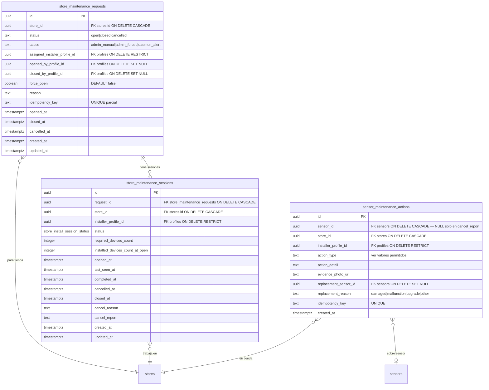
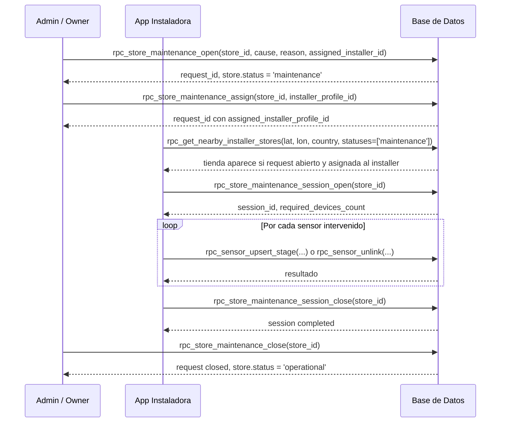
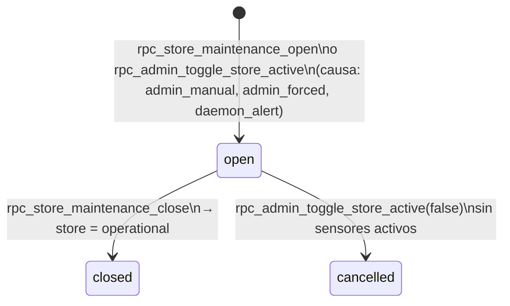
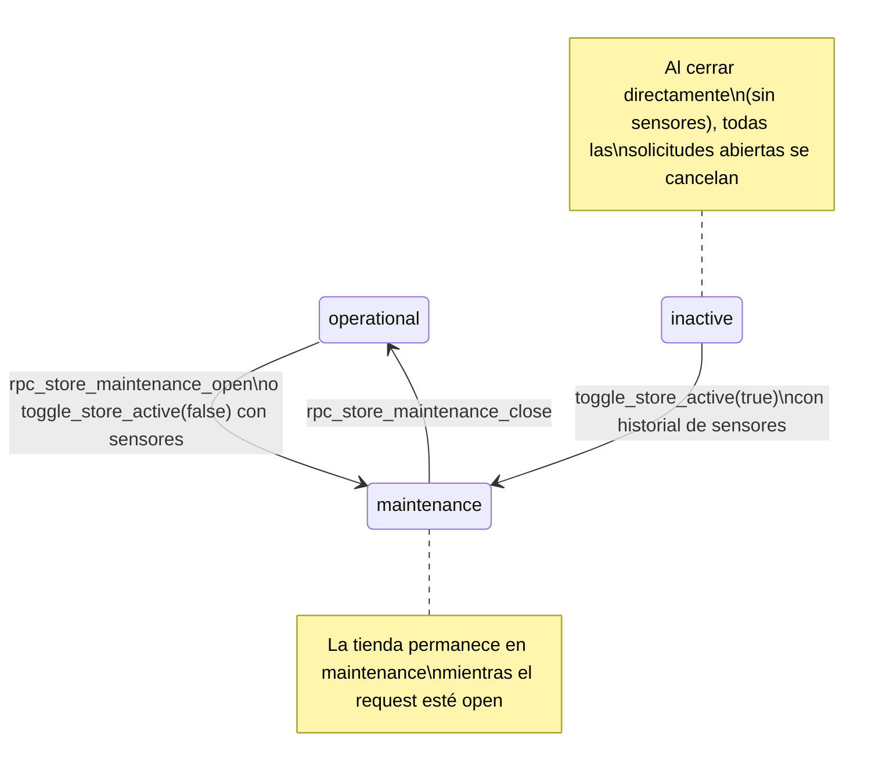

# Maintenance

El dominio de mantenimiento gestiona el ciclo de vida completo de las operaciones post-instalación en tiendas: desde la apertura administrativa de una solicitud de mantenimiento hasta la ejecución del trabajo por el instalador y el registro de acciones individuales sobre sensores.

---

## Modelo de datos

---

## Tabla `public.store_maintenance_requests`

Solicitud administrativa que pone una tienda en estado de mantenimiento. Es el punto de entrada del flujo de mantenimiento; lo crea el `owner`, `admin` o un daemon.

### Columnas

| Columna | Tipo | Notas |
|---|---|---|
| `id` | `uuid` | PK |
| `store_id` | `uuid` | FK → `stores.id` ON DELETE CASCADE |
| `status` | `text` | `open`, `closed`, `cancelled` |
| `cause` | `text` | Ver valores permitidos |
| `assigned_installer_profile_id` | `uuid` | Instalador asignado (opcional). FK → `profiles` ON DELETE RESTRICT |
| `opened_by_profile_id` | `uuid` | Quién abrió. FK → `profiles` ON DELETE SET NULL |
| `closed_by_profile_id` | `uuid` | Quién cerró. FK → `profiles` ON DELETE SET NULL |
| `force_open` | `boolean` | DEFAULT `false`. Si `true`, el RPC canceló sesiones activas existentes al abrir |
| `reason` | `text` | Descripción del motivo (opcional, no puede ser vacío si se provee) |
| `idempotency_key` | `text` | Para idempotencia en apertura. UNIQUE parcial (cuando no NULL) |
| `opened_at` | `timestamptz` | DEFAULT `NOW()` |
| `closed_at` / `cancelled_at` | `timestamptz` | |
| `created_at` / `updated_at` | `timestamptz` | |

### Valores permitidos: `cause`

| Valor | Descripción |
|---|---|
| `admin_manual` | Abierto manualmente por un admin/owner |
| `admin_forced` | Abierto forzadamente (cierra sesiones activas) |
| `daemon_alert` | Abierto automáticamente por un daemon de monitoreo |

### Constraints

| Constraint | Regla |
|---|---|
| `store_maintenance_requests_status_allowed_chk` | `open`, `closed`, `cancelled` |
| `store_maintenance_requests_cause_allowed_chk` | `admin_manual`, `admin_forced`, `daemon_alert` |
| `store_maintenance_requests_reason_not_empty_chk` | reason no puede ser string vacío si no es NULL |
| `store_maintenance_requests_idempotency_not_empty_chk` | idempotency_key no puede ser string vacío si no es NULL |

### Índices

| Índice | Tipo | Notas |
|---|---|---|
| `store_maintenance_requests_open_store_uq` | UNIQUE parcial | `(store_id) WHERE status = 'open'` — **una sola solicitud abierta por tienda** |
| `store_maintenance_requests_idempotency_uq` | UNIQUE parcial | `(idempotency_key) WHERE idempotency_key IS NOT NULL` |
| `store_maintenance_requests_store_status_idx` | btree | `(store_id, status, opened_at DESC)` |
| `store_maintenance_requests_assigned_status_idx` | btree | `(assigned_installer_profile_id, status, opened_at DESC)` |

---

## Tabla `public.store_maintenance_sessions`

Ver [sessions.md](./sessions.md) para la documentación completa de esta tabla.

---

## Tabla `public.sensor_maintenance_actions`

Log de acciones individuales realizadas sobre sensores durante una visita de mantenimiento. **No modifica la capacidad contractual** de la tienda por sí misma.

### Columnas

| Columna | Tipo | Notas |
|---|---|---|
| `id` | `uuid` | PK |
| `sensor_id` | `uuid` | FK → `sensors.id` ON DELETE CASCADE. Puede ser NULL solo si `action_type = 'maintenance_cancel_report'` |
| `store_id` | `uuid` | FK → `stores.id` ON DELETE CASCADE. Requerido siempre |
| `installer_profile_id` | `uuid` | FK → `profiles.user_id` ON DELETE RESTRICT |
| `action_type` | `text` | Ver valores permitidos |
| `action_detail` | `text` | Descripción libre (no puede ser vacío si se provee) |
| `evidence_photo_url` | `text` | URL de evidencia (no puede ser vacío si se provee) |
| `replacement_sensor_id` | `uuid` | FK → `sensors.id` ON DELETE SET NULL. Solo para `action_type = 'replacement'` |
| `replacement_reason` | `text` | Ver valores permitidos |
| `idempotency_key` | `text` | UNIQUE. Previene inserciones duplicadas |
| `created_at` | `timestamptz` | Solo insert |

### Valores permitidos: `action_type`

| Valor | Descripción |
|---|---|
| `maintenance_cancel_report` | Reporte de cancelación de mantenimiento. **No requiere `sensor_id`** |
| `replacement` | Reemplazo de sensor |
| `firmware_update` | Actualización de firmware |
| `calibration` | Calibración |
| `reboot` | Reinicio del dispositivo |
| `diagnostic` | Diagnóstico |
| `cleaning` | Limpieza física |
| `battery_replacement` | Cambio de batería |
| `reposition` | Reposición/reubicación (también generado internamente por `rpc_sensor_unlink`) |
| `other` | Otro |

### Valores permitidos: `replacement_reason`

| Valor | Descripción |
|---|---|
| `damaged` | Sensor dañado |
| `malfunction` | Mal funcionamiento |
| `upgrade` | Mejora planificada |
| `other` | Otro |

### Constraints

| Constraint | Regla |
|---|---|
| `sensor_maintenance_actions_action_type_allowed_chk` | Solo valores de la lista |
| `sensor_maintenance_actions_sensor_required_for_non_cancel_chk` | `action_type = 'maintenance_cancel_report' OR sensor_id IS NOT NULL` |
| `sensor_maintenance_actions_replacement_reason_allowed_chk` | Solo valores de la lista o NULL |
| `sensor_maintenance_actions_evidence_photo_url_not_empty_chk` | no vacío si no NULL |
| `sensor_maintenance_actions_idempotency_not_empty_chk` | no vacío si no NULL |

### Índices

| Índice | Tipo |
|---|---|
| `sensor_maintenance_actions_idempotency_uq` | UNIQUE |
| `sensor_maintenance_actions_sensor_created_idx` | btree `(sensor_id, created_at DESC)` |
| `sensor_maintenance_actions_store_created_idx` | btree `(store_id, created_at DESC)` |

---

## Creación automática de solicitudes por el sistema admin

Además de la apertura manual via `rpc_store_maintenance_open`, el sistema crea solicitudes de mantenimiento automáticamente en dos escenarios generados por `rpc_admin_toggle_store_active`:

| Escenario | `cause` | `force_open` | Descripción |
|---|---|---|---|
| Admin activa tienda con historial de sensores | `admin_manual` | `false` | El admin indica cuántos sensores instalar; el sistema crea la solicitud para que el instalador los instale |
| Admin cierra tienda con sensores activos | `admin_forced` | `true` | El sistema detecta sensores físicamente en la tienda y fuerza una solicitud de remoción antes de poder cerrar |

En ambos casos, el `reason` incluye el número de sensores objetivo en español:
- Activación: `"Reactivación de tienda: instalación de N sensores requerida"`
- Cierre: `"Cierre de tienda: remoción de N sensores instalados requerida"`

> **Nota:** Solo puede existir **una solicitud `open` por tienda** (índice único `store_maintenance_requests_open_store_uq`). Si ya existe una solicitud abierta al intentar cerrar la tienda, el RPC retorna `action_taken='maintenance_already_open'` sin crear duplicado.

---

## Flujo completo de mantenimiento

---

## RPCs de Mantenimiento

### `rpc_store_maintenance_open(p_store_id, p_cause, p_reason?, p_assigned_installer?, p_force?, p_idempotency_key?)`

Abre una solicitud de mantenimiento y pone la tienda en `status = 'maintenance'`. Si `p_force = true`, cancela cualquier sesión activa (instalación o mantenimiento) que exista en la tienda.

**Permisos:** `authenticated` (solo `owner`, `admin`), `service_role`.

**Parámetros:**

| Parámetro | Tipo | Requerido | Notas |
|---|---|---|---|
| `p_store_id` | `uuid` | **Sí** | Debe existir |
| `p_cause` | `text` | **Sí** | `admin_manual`, `admin_forced`, `daemon_alert` |
| `p_reason` | `text` | No | Descripción del motivo |
| `p_assigned_installer_profile_id` | `uuid` | No | Debe ser perfil `installer` activo |
| `p_force` | `boolean` | No | DEFAULT `false`. Si `true`, cancela sesiones activas |
| `p_idempotency_key` | `text` | No | Para idempotencia |

**Retorna:** `request_id`, `status`, `store_status`, `assigned_installer_profile_id`, `result`, `error`.

**Lógica:**
- Si ya existe request `open` → lo actualiza (causa, asignado, etc.).
- Si `p_force = true` → cancela sesiones de instalación y mantenimiento abiertas antes de crear el request.
- Siempre actualiza `stores.status = 'maintenance'`.

**Restricciones frontend:**
- Solo `owner` o `admin` activos pueden llamar este RPC.
- Para asignar un instalador al crear, debe ser un perfil `installer` activo.
- Si hay sesiones activas y no se pasa `p_force = true`, el request se crea pero las sesiones permanecen (la tienda puede tener sesiones activas transicionalmente).

---

### `rpc_store_maintenance_assign(p_store_id, p_installer_profile_id, p_request_id?)`

Asigna o reasigna un instalador a la solicitud de mantenimiento abierta de una tienda.

**Permisos:** `authenticated` (solo `owner`, `admin`), `service_role`.

**Parámetros:**

| Parámetro | Tipo | Requerido | Notas |
|---|---|---|---|
| `p_store_id` | `uuid` | **Sí** | |
| `p_installer_profile_id` | `uuid` | **Sí** | Debe ser perfil `installer` activo |
| `p_request_id` | `uuid` | No | Si NULL, usa la solicitud open más reciente |

**Retorna:** `request_id`, `status`, `assigned_installer_profile_id`, `result`, `error`.

**Restricciones:**
- Solo `owner`/`admin`.
- No se puede asignar si ya existe una sesión de mantenimiento abierta de otro instalador.

---

### `rpc_store_maintenance_unassign(p_store_id, p_request_id?)`

Elimina el instalador asignado de la solicitud de mantenimiento abierta.

**Permisos:** `authenticated` (solo `owner`, `admin`), `service_role`.

**Parámetros:**

| Parámetro | Tipo | Notas |
|---|---|---|
| `p_store_id` | `uuid` | Requerido |
| `p_request_id` | `uuid` | Opcional; si NULL usa request open más reciente |

**Restricciones:**
- No se puede desasignar si hay una sesión de mantenimiento `open` activa.
- Solo `owner`/`admin`.

---

### `rpc_store_maintenance_close(p_store_id, p_request_id?, p_close_reason?, p_force_close_open_session?)`

Cierra la solicitud de mantenimiento y retorna la tienda a `status = 'operational'`.

**Permisos:** `authenticated` (`owner`, `admin`, o `installer` asignado), `service_role`.

**Parámetros:**

| Parámetro | Tipo | Requerido | Notas |
|---|---|---|---|
| `p_store_id` | `uuid` | **Sí** | |
| `p_request_id` | `uuid` | No | Si NULL, usa el request open más reciente |
| `p_close_reason` | `text` | No | Razón de cierre |
| `p_force_close_open_session` | `boolean` | No | DEFAULT `false`. Si `true`, cancela sesión de mantenimiento abierta |

**Retorna:** `request_id`, `status`, `store_status`, `result`, `error`.

**Lógica:**
- Si hay sesión de mantenimiento `open` y `p_force_close_open_session = false` → error.
- Si `p_force_close_open_session = true` → cancela la sesión y cierra el request.
- Siempre actualiza `stores.status = 'operational'`.

**Restricciones frontend:**
- Un `installer` solo puede cerrar si es el `assigned_installer_profile_id` del request.
- `owner`/`admin` pueden cerrar cualquier request.
- Si hay sesión abierta, **debe** pasarse `p_force_close_open_session = true` para proceder.

---

### `rpc_store_maintenance_session_open(p_store_id, p_request_id?)`

Ver [sessions.md](./sessions.md#rpc_store_maintenance_session_openp_store_id-p_request_id) para documentación completa.

---

## Diagrama de estados de `store_maintenance_requests.status`

---

## Relación con `stores.status` durante mantenimiento

---

## Acciones sobre sensores durante mantenimiento

Durante una sesión de mantenimiento, el instalador puede:

1. **Instalar nuevos sensores** → `rpc_sensor_upsert_stage(...)` (requiere sesión de mantenimiento abierta).
2. **Desvincular sensores** → `rpc_sensor_unlink(...)` (requiere sesión de instalación o mantenimiento abierta).
3. Internamente, `rpc_sensor_unlink` crea automáticamente un `sensor_maintenance_actions` de tipo `reposition`.

---

## Restricciones globales para el frontend

| Acción | Rol requerido | Restricciones adicionales |
|---|---|---|
| Abrir solicitud de mantenimiento | `owner`, `admin` | |
| Asignar instalador | `owner`, `admin` | Perfil debe ser `installer` activo; sin sesión abierta de otro installer |
| Desasignar instalador | `owner`, `admin` | Sin sesión de mantenimiento activa |
| Cerrar solicitud de mantenimiento | `owner`, `admin`, `installer` asignado | `installer` solo puede cerrar el que le está asignado |
| Forzar cierre con sesión abierta | `owner`, `admin`, `installer` asignado | Pasar `p_force_close_open_session = true` |
| Abrir sesión de mantenimiento | `installer` | Solo si es el asignado (o sin asignado); sin otra sesión activa |
| Tienda sin request abierto aparece en mantenimiento | ❌ | Solo tiendas con request `open` son visibles en el listado `rpc_get_nearby_installer_stores` con `status=maintenance` |
| Acceso directo a tablas | ❌ | RLS habilitado |
