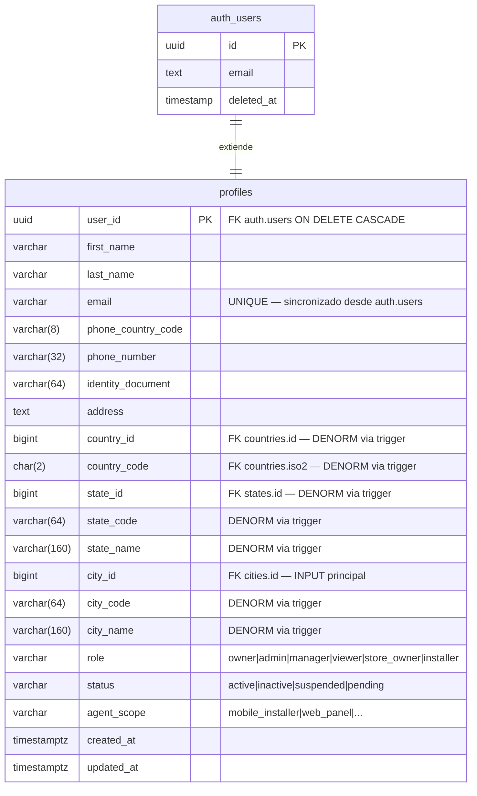
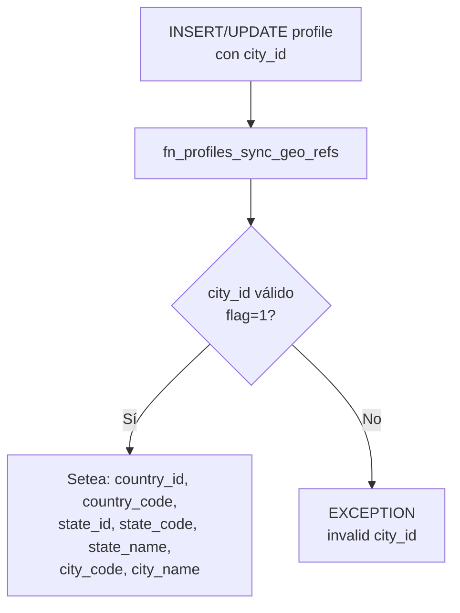

# Profiles

La tabla `profiles` extiende `auth.users` de Supabase con datos de negocio: rol, estado, alcance de acceso y ubicación geográfica del usuario. Es la fuente de autorización para todos los RPCs del sistema.

---

## Modelo de datos



---

## Tabla `public.profiles`

### Columnas

| Columna | Tipo | Auto | Notas |
|---|---|---|---|
| `user_id` | `uuid` | — | PK y FK → `auth.users(id)` ON DELETE CASCADE |
| `first_name` | `varchar` | — | Requerido |
| `last_name` | `varchar` | — | Requerido |
| `email` | `varchar` | — | UNIQUE. Sincronizado desde `auth.users.email` en el RPC |
| `phone_country_code` | `varchar(8)` | — | Opcional |
| `phone_number` | `varchar(32)` | — | Opcional |
| `identity_document` | `varchar(64)` | — | Opcional |
| `address` | `text` | — | Opcional |
| `country_id` | `bigint` | **Trigger** | FK → `countries.id`. Derivado de `city_id` |
| `country_code` | `char(2)` | **Trigger** | Derivado de `city_id`. Formato `[A-Z]{2}` |
| `state_id` | `bigint` | **Trigger** | FK → `states.id`. Derivado de `city_id` |
| `state_code` | `varchar(64)` | **Trigger** | `iso2` del estado, o `state_id::TEXT` si no existe |
| `state_name` | `varchar(160)` | **Trigger** | Nombre del estado |
| `city_id` | `bigint` | — | FK → `cities.id`. **Campo de entrada geográfica** |
| `city_code` | `varchar(64)` | **Trigger** | `city_id::TEXT` |
| `city_name` | `varchar(160)` | **Trigger** | Nombre de la ciudad |
| `role` | `varchar` | `'installer'` | Ver valores permitidos |
| `status` | `varchar` | `'active'` | Ver valores permitidos |
| `agent_scope` | `varchar` | Auto por rol | Ver lógica de default |
| `created_at` | `timestamptz` | `NOW()` | |
| `updated_at` | `timestamptz` | `NOW()` | |

### Valores permitidos: `role`

| Valor | Descripción |
|---|---|
| `owner` | Propietario del sistema. Máximos privilegios en RPCs |
| `admin` | Administrador. Puede crear/modificar tiendas y usuarios |
| `manager` | Gestor. Permisos intermedios |
| `viewer` | Solo lectura |
| `store_owner` | Propietario de tienda |
| `installer` | Técnico instalador. Usa la app móvil |

### Valores permitidos: `status`

| Valor | Descripción |
|---|---|
| `active` | Cuenta activa, puede operar |
| `inactive` | Desactivada |
| `suspended` | Suspendida temporalmente |
| `pending` | Pendiente de activación |

### `agent_scope` — lógica de default

Si no se pasa explícitamente:
- `role = 'installer'` → `agent_scope = 'mobile_installer'`
- cualquier otro rol → `agent_scope = 'web_panel'`

### Constraints de integridad

| Constraint | Regla |
|---|---|
| `profiles_email_unique` | Email único en la tabla |
| `profiles_role_allowed` | Solo valores de la lista de roles |
| `profiles_status_allowed` | Solo valores de la lista de estados |
| `profiles_agent_scope_not_empty` | No puede ser string vacío |
| `profiles_country_code_format` | `country_code ~ '^[A-Z]{2}$'` |
| `profiles_state_code_not_empty` | No puede ser string vacío |
| `profiles_state_name_not_empty` | No puede ser string vacío |
| `profiles_city_code_not_empty` | No puede ser string vacío |
| `profiles_city_name_not_empty` | No puede ser string vacío |

---

## Trigger

### `trg_profiles_sync_geo_refs` → `fn_profiles_sync_geo_refs()`

**Evento:** `BEFORE INSERT OR UPDATE` en `profiles`.

**Lógica:** Dado `city_id`, resuelve y denormaliza todos los campos geográficos consultando `cities → states → countries` (con `flag = 1` en cada nivel). Lanza excepción si la ciudad no existe o tiene `flag != 1`.



---

## RPCs de Usuarios

### `rpc_upsert_user_profile(...)`

Crea o actualiza el perfil de un usuario existente en `auth.users`. Opera como UPSERT: si el perfil existe, lo actualiza; si no, lo crea.

**Permisos:** `authenticated` (solo `owner` o `admin` activos), `service_role`.

**Parámetros:**

| Parámetro | Tipo | Requerido | Notas |
|---|---|---|---|
| `p_user_id` | `uuid` | **Sí** | Debe existir en `auth.users` y no estar eliminado |
| `p_first_name` | `text` | **Sí** | No puede ser vacío |
| `p_last_name` | `text` | **Sí** | No puede ser vacío |
| `p_role` | `text` | **Sí** | Valor de la lista de roles permitidos |
| `p_status` | `text` | **Sí** | Valor de la lista de estados permitidos |
| `p_city_id` | `bigint` | **Sí** | Debe existir con `flag=1` |
| `p_agent_scope` | `text` | No | Si NULL, se asigna automáticamente por rol |
| `p_phone_country_code` | `text` | No | |
| `p_phone_number` | `text` | No | |
| `p_identity_document` | `text` | No | |
| `p_address` | `text` | No | |

**Retorna:** `user_id uuid`, `result boolean`, `error text`.

**Restricciones frontend:**
- Solo `owner` o `admin` con `status = 'active'` pueden ejecutar este RPC desde el cliente.
- El `email` del perfil se toma de `auth.users.email` automáticamente; no se puede pasar como parámetro.
- Los campos geográficos (`country_code`, `state_id`, etc.) se derivan de `city_id` automáticamente.

---

### `rpc_user_access_gate(p_required_scope?, p_target_user_id?)`

Verifica si un usuario tiene acceso al sistema bajo el scope requerido. Es el RPC de bootstrap de sesión de la app instaladora.

**Permisos:** `authenticated`, `service_role`.

**Parámetros:**

| Parámetro | Tipo | Default | Notas |
|---|---|---|---|
| `p_required_scope` | `text` | `'mobile_installer'` | Scope que debe coincidir con `agent_scope` del perfil |
| `p_target_user_id` | `uuid` | `NULL` | Si NULL, evalúa al usuario autenticado actual |

**Retorna:**

| Campo | Tipo | Descripción |
|---|---|---|
| `user_id` | `uuid` | ID del usuario evaluado |
| `email` | `text` | Email del usuario |
| `country_code` | `text` | País del perfil |
| `role` | `text` | Rol del perfil |
| `status` | `text` | Estado del perfil |
| `agent_scope` | `text` | Scope del perfil |
| `has_profile` | `boolean` | Si tiene perfil |
| `can_access` | `boolean` | Decisión final de acceso |
| `access_code` | `text` | Código de resultado (ver tabla) |
| `access_message` | `text` | Mensaje legible |

**Códigos de respuesta (`access_code`):**

| Código | Significado |
|---|---|
| `ok` | Acceso concedido |
| `auth_required` | No hay usuario autenticado |
| `user_required` | No se pudo determinar el usuario objetivo |
| `forbidden_target_user` | Intentó evaluar otro usuario sin permisos suficientes |
| `auth_user_not_found` | El usuario no existe en `auth.users` o fue eliminado |
| `profile_not_found` | No tiene perfil en `profiles` |
| `profile_inactive` | El perfil no tiene `status = 'active'` |
| `role_not_allowed` | El rol no es `installer` (la app solo admite instaladores) |
| `scope_not_allowed` | El `agent_scope` no coincide con `p_required_scope` |

**Restricciones frontend:**
- Un usuario autenticado puede evaluarse a sí mismo libremente.
- Para evaluar a otro usuario, se necesita `role IN ('owner', 'admin')` con `status = 'active'`.
- Si `can_access = false`, no proceder con el flujo de instalación.

---

### `rpc_user_open_installation_store(p_target_user_id?)`

Retorna el `store_id` de la sesión de instalación abierta del usuario, si existe. Es parte del bootstrap de la app.

**Permisos:** `authenticated`, `service_role`.

**Parámetros:**

| Parámetro | Tipo | Default |
|---|---|---|
| `p_target_user_id` | `uuid` | `NULL` → usa el usuario autenticado |

**Retorna:** `store_id uuid` (puede ser `NULL` si no hay sesión abierta).

**Restricciones frontend:**
- Un usuario solo puede consultar su propia sesión; para consultar la de otro necesita `role IN ('owner', 'admin')`.
- Retorna siempre una fila (con `store_id = NULL` si no hay sesión).

---

### `rpc_user_active_session(p_target_user_id?)`

Versión unificada del resolver de sesión activa: retorna el `store_id` y el **tipo de sesión** (`install` o `maintenance`) de la sesión más reciente abierta del usuario.

**Permisos:** `authenticated`, `service_role`.

**Parámetros:**

| Parámetro | Tipo | Default |
|---|---|---|
| `p_target_user_id` | `uuid` | `NULL` → usa el usuario autenticado |

**Retorna:**

| Campo | Tipo | Notas |
|---|---|---|
| `store_id` | `uuid` | `NULL` si no hay sesión activa |
| `session_type` | `user_active_session_type` | `'install'` o `'maintenance'` |

**Prioridad de resolución:** si hay una sesión de instalación y una de mantenimiento abiertas simultáneamente (caso raro), se retorna la más reciente por `last_seen_at`. Si empatan, `install` tiene precedencia sobre `maintenance`.

**Restricciones frontend:**
- Un usuario puede consultar su propia sesión activa sin restricciones.
- Para consultar la de otro usuario se requiere `role IN ('owner', 'admin')` con `status = 'active'`.
- Retorna siempre una fila (`store_id = NULL`, `session_type = NULL` si no hay sesión).

---

---

## RPCs Administrativos del Dashboard

### `rpc_admin_list_users(...)`

Lista todos los perfiles con paginación, búsqueda y filtros para el panel admin.

**Permisos:** `authenticated` (`owner`, `admin`), `service_role`.

**Parámetros:**

| Parámetro | Tipo | Default | Notas |
|---|---|---|---|
| `p_page` | `int` | `1` | |
| `p_page_size` | `int` | `20` | |
| `p_search` | `text` | `NULL` | Busca en `first_name`, `last_name`, `email` (ILIKE) |
| `p_filter_role` | `text` | `NULL` | Filtro exacto por rol |
| `p_filter_status` | `text` | `NULL` | Filtro exacto por status |
| `p_sort_by` | `text` | `'updated_at'` | `updated_at`, `first_name`, `last_name`, `email`, `role`, `status` |
| `p_sort_order` | `text` | `'desc'` | `'asc'` o `'desc'` |

**Retorna (TABLE):**

| Campo | Tipo | Notas |
|---|---|---|
| `user_id` | `uuid` | |
| `first_name` | `text` | |
| `last_name` | `text` | |
| `email` | `text` | |
| `role` | `text` | |
| `status` | `text` | |
| `agent_scope` | `text` | |
| `phone_country_code` | `text` | |
| `phone_number` | `text` | |
| `city_name` | `text` | |
| `state_name` | `text` | |
| `country_code` | `text` | |
| `devices_installed_count` | `int` | COUNT `sensor_installations` WHERE `installer_profile_id` AND `status='installed'` |
| `stores_installed_count` | `int` | COUNT DISTINCT `store_id` en `store_installation_sessions` WHERE `status='completed'` |
| `last_sign_in_at` | `timestamptz` | De `auth.users` |
| `total_count` | `bigint` | Total sin paginación (`COUNT(*) OVER()`) |

---

### `rpc_admin_get_user_detail(p_user_id)`

Detalle completo de un usuario para la vista admin, incluyendo datos de `auth.users`, conteos y sesión activa.

**Permisos:** `authenticated` (`owner`, `admin`), `service_role`.

**Parámetros:** `p_user_id uuid` (requerido).

**Retorna (RECORD):**

| Campo | Fuente | Notas |
|---|---|---|
| Todos los campos de `profiles` | `profiles` | |
| `auth_email` | `auth.users` | |
| `auth_created_at` | `auth.users` | |
| `auth_last_sign_in_at` | `auth.users` | |
| `auth_email_confirmed_at` | `auth.users` | |
| `devices_installed_count` | Calculado | Igual que en el listado |
| `stores_installed_count` | Calculado | Igual que en el listado |
| `active_session_store_id` | Calculado | UUID de la tienda con sesión activa, o NULL |
| `active_session_type` | Calculado | `'install'`, `'maintenance'`, o NULL |

---

### `rpc_admin_deactivate_user(p_user_id, p_new_status, p_close_active_sessions?)`

Desactiva o suspende un usuario, con opción de cancelar sus sesiones activas.

**Permisos:** `authenticated` (`owner`, `admin`), `service_role`.

**Parámetros:**

| Parámetro | Tipo | Requerido | Notas |
|---|---|---|---|
| `p_user_id` | `uuid` | **Sí** | |
| `p_new_status` | `text` | **Sí** | `'inactive'` o `'suspended'` |
| `p_close_active_sessions` | `boolean` | No | DEFAULT `false`. Si `true`, cancela sesiones abiertas con `cancel_reason='user_deactivated'` |

**Retorna:**

| Campo | Tipo | Notas |
|---|---|---|
| `user_id` | `uuid` | |
| `previous_status` | `text` | |
| `new_status` | `text` | |
| `sessions_closed` | `int` | Número de sesiones canceladas |
| `result` | `boolean` | |
| `error` | `text` | |

**Restricciones:**
- No puede desactivarse a uno mismo.
- Un `admin` no puede desactivar a otro `owner`.
- Solo `owner` puede desactivar a otro `owner`.

---

### `rpc_admin_delete_user(p_user_id, p_reason?)`

Soft-delete de un usuario: marca el perfil como `'inactive'` y libera asignaciones de mantenimiento. La eliminación en `auth.users` la realiza el caller vía Admin API.

**Permisos:** `authenticated` (solo `owner`), `service_role`.

**Parámetros:**

| Parámetro | Tipo | Requerido | Notas |
|---|---|---|---|
| `p_user_id` | `uuid` | **Sí** | |
| `p_reason` | `text` | No | Razón del borrado |

**Retorna:** `user_id uuid`, `result boolean`, `error text`.

**Lógica:**
- Bloquea si el usuario tiene sesiones `open` activas (install o maintenance).
- Libera asignaciones en `store_maintenance_requests` (`assigned_installer_profile_id = NULL`).
- Marca `profiles.status = 'inactive'` como marcador de borrado lógico.
- La eliminación en `auth.users` queda a cargo del caller mediante el Admin API de Supabase.

**Restricciones:**
- Exclusivo de `owner`; `admin` no puede ejecutar este RPC.
- No se puede eliminar si hay sesiones abiertas.

---

## Flujo de autorización en RPCs

```mermaid
flowchart TD
    A[Llamada a cualquier RPC] --> B{Es service_role\no console admin?}
    B -- Sí --> Z[Acceso privilegiado\nsin restricciones de rol]
    B -- No --> C{auth.uid() no NULL?}
    C -- No --> ERR1[ERROR: authenticated user required]
    C -- Sí --> D[Busca perfil en profiles\nWHERE user_id = auth.uid()\nAND status = 'active']
    D --> E{Tiene perfil\nactivo?}
    E -- No --> ERR2[ERROR: según RPC]
    E -- Sí --> F{Rol suficiente?}
    F -- No --> ERR3[ERROR: insufficient permissions]
    F -- Sí --> G[Ejecuta lógica del RPC]
```

---

## Restricciones globales para el frontend

| Acción | Rol requerido | Restricciones adicionales |
|---|---|---|
| Crear/actualizar perfil | `owner`, `admin` (activos) | Solo para usuarios existentes en `auth.users` |
| Listar usuarios (admin) | `owner`, `admin` | |
| Ver detalle de usuario (admin) | `owner`, `admin` | Incluye datos de `auth.users` |
| Desactivar/suspender usuario | `owner`, `admin` | Admin no puede operar sobre owner |
| Eliminar usuario (soft delete) | `owner` solamente | Sin sesiones activas; limpieza de assignments |
| Verificar acceso propio | cualquier autenticado | |
| Verificar acceso de otro usuario | `owner`, `admin` (activos) | |
| Consultar sesión activa propia | cualquier autenticado | |
| Consultar sesión activa de otro | `owner`, `admin` (activos) | |
| Acceso directo a tabla `profiles` | ❌ | RLS habilitado, sin políticas directas |
| Modificar `email` en perfil | ❌ | Se sincroniza desde `auth.users` automáticamente |
| Enviar `country_code`/`state_id` directamente | ❌ | Se derivan de `city_id` vía trigger |
