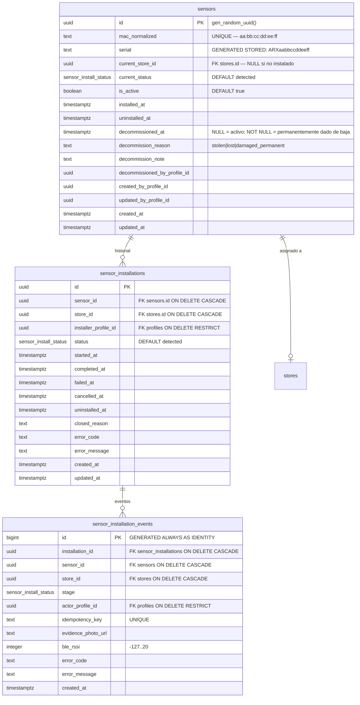
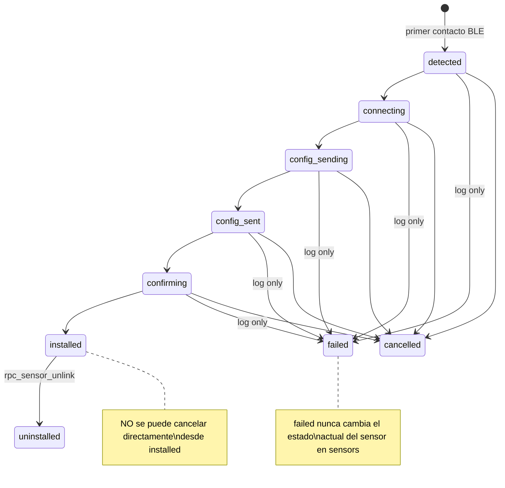
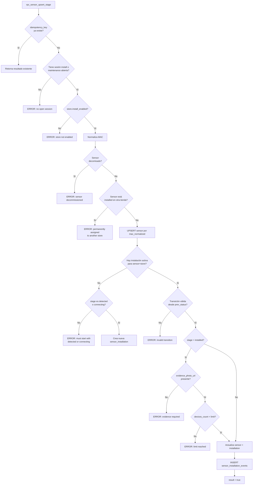
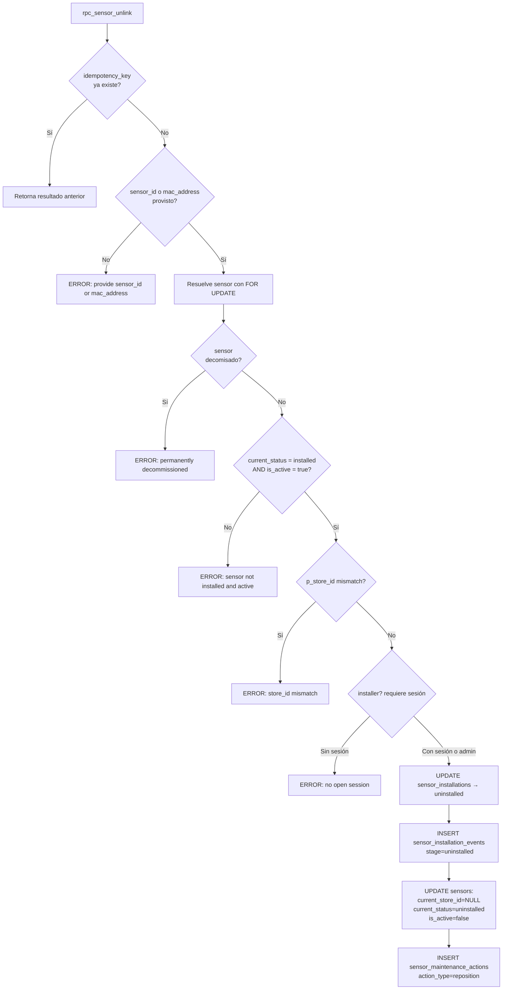
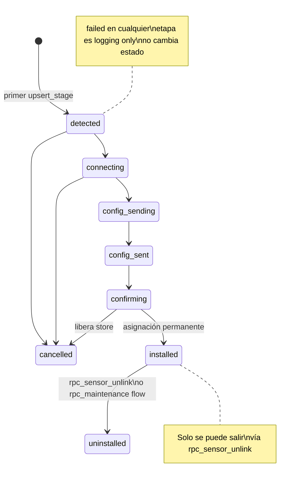

# Sensors

El dominio de sensores gestiona el ciclo de vida completo de los dispositivos físicos: desde su primera detección BLE hasta la instalación permanente, desinstalación, reubicación y decomisado. Es el núcleo del flujo operativo de la app instaladora.

---

## Modelo de datos



---

## Enum `public.sensor_install_status`

```
detected → connecting → config_sending → config_sent → confirming → installed
                                                      ↘ failed (logging)
                                                      ↘ cancelled
installed → uninstalled
```

| Valor | Descripción |
|---|---|
| `detected` | Sensor detectado por BLE por primera vez |
| `connecting` | Intentando conexión BLE |
| `config_sending` | Enviando configuración WiFi |
| `config_sent` | Configuración enviada, esperando confirmación |
| `confirming` | Pre-registrado: visible en lista de la tienda |
| `installed` | **Asignación permanente.** El sensor queda vinculado al store |
| `failed` | Etapa de log: error no terminal, no cambia estado actual |
| `cancelled` | Instalación cancelada (solo si no llegó a `installed`) |
| `uninstalled` | Desinstalado (requiere flujo de unlink o mantenimiento) |

### Transiciones válidas



---

## Tabla `public.sensors`

Identidad canónica del sensor por MAC. Un sensor existe una sola vez; sus instalaciones son históricas.

### Columnas

| Columna | Tipo | Auto | Notas |
|---|---|---|---|
| `id` | `uuid` | `gen_random_uuid()` | PK |
| `mac_normalized` | `text` | Via `fn_normalize_mac` | Formato `aa:bb:cc:...` lowercase, pares separados por `:`. **UNIQUE** |
| `serial` | `text` | **GENERATED STORED** | `'ARX' || UPPER(REPLACE(mac_normalized, ':', ''))`. No modificable. Ej: `ARXAABBCCDDEEFF` |
| `current_store_id` | `uuid` | Lógica RPC | FK → `stores.id` ON DELETE SET NULL. NULL si no está instalado |
| `current_status` | `sensor_install_status` | `'detected'` | Estado actual del ciclo de vida |
| `is_active` | `boolean` | `true` | `false` cuando cancelado/desinstalado/decomisado |
| `installed_at` | `timestamptz` | Lógica RPC | Primera vez que llegó a `installed` |
| `uninstalled_at` | `timestamptz` | Lógica RPC | Primera vez que se desinstalό |
| `decommissioned_at` | `timestamptz` | — | **Si NOT NULL: sensor permanentemente dado de baja. Bloquea toda futura instalación** |
| `decommission_reason` | `text` | — | Solo `stolen`, `lost`, `damaged_permanent` |
| `decommission_note` | `text` | — | Nota libre |
| `decommissioned_by_profile_id` | `uuid` | — | FK → `profiles.user_id` |
| `created_by_profile_id` | `uuid` | — | FK → `profiles.user_id` |
| `updated_by_profile_id` | `uuid` | — | FK → `profiles.user_id` |
| `created_at` / `updated_at` | `timestamptz` | `NOW()` | |

### Constraints

| Constraint | Regla |
|---|---|
| `sensors_mac_normalized_chk` | `mac_normalized ~ '^([0-9a-f]{2})(:[0-9a-f]{2}){3,}$'` — mínimo 4 pares |
| `sensors_decommission_reason_allowed_chk` | Solo `stolen`, `lost`, `damaged_permanent` o NULL |

### Índices

| Índice | Tipo | Notas |
|---|---|---|
| `sensors_mac_normalized_uq` | UNIQUE | Garantiza unicidad por MAC |
| `sensors_serial_uq` | UNIQUE | Garantiza unicidad por serial ARX |
| `sensors_serial_prefix_idx` | btree (text_pattern_ops) | Búsqueda por prefijo de serial |
| `sensors_mac_normalized_prefix_idx` | btree (text_pattern_ops) | Búsqueda por prefijo de MAC |
| `sensors_store_status_idx` | btree | Filtro `(current_store_id, current_status)` |
| `sensors_decommissioned_idx` | btree partial | Solo donde `decommissioned_at IS NOT NULL` |

### Trigger

`trg_sensors_set_updated_at` → `fn_set_updated_at()`: actualiza `updated_at = NOW()` en cada UPDATE.

---

## Tabla `public.sensor_installations`

Registro histórico de cada intento de instalación (sensor × store). Un sensor puede tener múltiples instalaciones históricas, pero **solo una activa simultáneamente** (índice único parcial).

| Columna | Tipo | Notas |
|---|---|---|
| `id` | `uuid` | PK |
| `sensor_id` | `uuid` | FK → `sensors.id` ON DELETE CASCADE |
| `store_id` | `uuid` | FK → `stores.id` ON DELETE CASCADE |
| `installer_profile_id` | `uuid` | FK → `profiles.user_id` ON DELETE RESTRICT |
| `status` | `sensor_install_status` | Estado de la instalación |
| `started_at` | `timestamptz` | Momento de creación |
| `completed_at` | `timestamptz` | Cuando llegó a `installed` |
| `failed_at` | `timestamptz` | Primera falla (logging) |
| `cancelled_at` | `timestamptz` | Cuando se canceló |
| `uninstalled_at` | `timestamptz` | Cuando se desinstaló |
| `closed_reason` | `text` | Razón de cierre (ej. `'unlinked'`) |
| `error_code` / `error_message` | `text` | Último error registrado |
| `created_at` / `updated_at` | `timestamptz` | |

### Índice único activo

```sql
UNIQUE (sensor_id) WHERE status IN ('detected', 'connecting', 'config_sending', 'config_sent', 'confirming', 'installed')
```
Garantiza que un sensor **no puede tener dos instalaciones activas simultáneamente**.

---

## Tabla `public.sensor_installation_events`

Log append-only de cada transición de etapa. **Nunca se modifica un evento existente.**

| Columna | Tipo | Notas |
|---|---|---|
| `id` | `bigint` | GENERATED ALWAYS AS IDENTITY — PK |
| `installation_id` | `uuid` | FK → `sensor_installations.id` ON DELETE CASCADE |
| `sensor_id` | `uuid` | FK → `sensors.id` ON DELETE CASCADE |
| `store_id` | `uuid` | FK → `stores.id` ON DELETE CASCADE |
| `stage` | `sensor_install_status` | Etapa registrada |
| `actor_profile_id` | `uuid` | FK → `profiles.user_id` ON DELETE RESTRICT |
| `idempotency_key` | `text` | **UNIQUE** — previene duplicados |
| `evidence_photo_url` | `text` | URL de evidencia fotográfica (requerida en `installed`) |
| `ble_rssi` | `integer` | Señal BLE en dBm. Rango `-127..20` |
| `error_code` / `error_message` | `text` | Error del stage |
| `created_at` | `timestamptz` | Solo insert, no se actualiza |

---

## Función de normalización de MAC

### `fn_normalize_mac(p_mac TEXT)`

Función `IMMUTABLE` que convierte cualquier formato de MAC a `lowercase pairs separados por ':'`.

**Acepta:** `"AA:BB:CC:DD:EE:FF"`, `"aabbccddeeff"`, `"AA-BB-CC-DD-EE-FF"`, etc.

**Reglas de validación:**
- No puede ser NULL o vacío.
- Debe contener caracteres hexadecimales.
- Debe tener cantidad par de dígitos hexadecimales.
- Mínimo 4 pares (8 caracteres hex).

---

## RPC `rpc_sensor_upsert_stage(...)`

El RPC principal del flujo de instalación de sensores. Maneja **upsert idempotente** de cada etapa del ciclo de instalación.

**Permisos:** `authenticated` (solo `installer`), `service_role`.

**Parámetros:**

| Parámetro | Tipo | Requerido | Notas |
|---|---|---|---|
| `p_idempotency_key` | `text` | **Sí** | Clave única por intento de etapa. Si ya existe, retorna resultado anterior (idempotencia) |
| `p_store_id` | `uuid` | **Sí** | Tienda objetivo |
| `p_mac_address` | `text` | **Sí** | MAC del sensor (cualquier formato; normalizado internamente) |
| `p_stage` | `sensor_install_status` | **Sí** | Etapa a registrar |
| `p_wifi_ssid` | `text` | No | Si se provee, actualiza `store_context.wifi_ssid` |
| `p_wifi_password` | `text` | No | Se encripta antes de guardar en `store_context` |
| `p_error_code` | `text` | No | Para etapas `failed` |
| `p_error_message` | `text` | No | Para etapas `failed` |
| `p_evidence_photo_url` | `text` | Condicional | **Obligatorio** cuando `p_stage = 'installed'` |
| `p_ble_rssi` | `integer` | No | Señal BLE. Rango `-127..20` |

**Retorna:** `sensor_id uuid`, `installation_id uuid`, `result boolean`, `error text`.

### Flujo interno



### Comportamiento especial por etapa

| Etapa | Qué hace en `sensors` |
|---|---|
| `detected`, `connecting`, `config_sending`, `config_sent` | Actualiza solo `current_status` (nunca retrocede desde `installed`/`confirming`) |
| `failed` | **Solo log**: no cambia `current_status` del sensor |
| `confirming` | Asigna `current_store_id = p_store_id` temporalmente |
| `installed` | Asignación permanente: `current_store_id`, `installed_at`, `is_active = true` |
| `cancelled` | Si venía de `confirming`: libera `current_store_id = NULL`. Si no: solo metadatos |
| `uninstalled` | `current_store_id = NULL`, `is_active = false`, `uninstalled_at` |

### Guard de reasignación permanente

A partir de `014_sensor_relocation.sql`, el RPC incluye un guard adicional: **un sensor en estado `installed` no puede ser procesado hacia otra tienda**. Si `p_store_id` difiere del `current_store_id` del sensor y el sensor está en estado `installed`, el RPC retorna error:

```
sensor <serial> is currently installed at store <store_id> and cannot be reassigned
```

Para mover un sensor instalado, primero debe desvincularse con `rpc_sensor_unlink`.

### Restricciones frontend

- Siempre se requiere `idempotency_key`; generarla del lado cliente (UUID v4 por intento).
- El installer debe tener sesión de instalación O mantenimiento abierta para la tienda.
- `evidence_photo_url` es **obligatoria** para el stage `installed`.
- Si `p_wifi_password` se envía, se cifra en el servidor; el frontend no debe almacenarla.
- No se puede `cancelled` un sensor en estado `installed`; usar `rpc_sensor_unlink`.
- La primera etapa de una nueva instalación debe ser `detected` o `connecting`.
- Un sensor instalado en otra tienda bloquea cualquier intento de registrarle una etapa.

---

## RPC `rpc_sensor_unlink(...)`

Desvincula un sensor activamente instalado de su tienda actual. Es la única forma válida de "desinstalar" un sensor en estado `installed`.

**Permisos:** `authenticated` (`owner`, `admin`, o `installer` con sesión abierta), `service_role`.

**Parámetros:**

| Parámetro | Tipo | Requerido | Notas |
|---|---|---|---|
| `p_sensor_id` | `uuid` | Cond. | Al menos uno de `sensor_id` o `mac_address` |
| `p_mac_address` | `text` | Cond. | Al menos uno de `sensor_id` o `mac_address` |
| `p_store_id` | `uuid` | No | Si se provee, debe coincidir con el store actual del sensor |
| `p_reason` | `text` | No | Razón del desvinculado |
| `p_evidence_photo_url` | `text` | No | Evidencia fotográfica opcional |
| `p_idempotency_key` | `text` | No | Para idempotencia |

**Retorna:** `sensor_id uuid`, `previous_store_id uuid`, `result boolean`, `error text`.

### Flujo



**Restricciones frontend:**
- Un `installer` necesita sesión de instalación o mantenimiento abierta para la tienda del sensor.
- `owner` y `admin` pueden desvincular sin sesión.
- El sensor debe estar en estado `installed` y `is_active = true`.
- Un sensor decomisado (`decommissioned_at IS NOT NULL`) no puede desvincularse.

---

## Diagrama de estados del sensor



---

## Contador de dispositivos y límite de la tienda

Al registrar la etapa `installed`, el RPC valida que:

```
COUNT(sensors WHERE current_store_id = p_store_id AND current_status = 'installed' AND is_active = TRUE) < stores.authorized_devices_count
```

Si se alcanza el límite, el RPC retorna error `authorized_devices_count reached for store X`.

---

---

## RPCs Administrativos del Dashboard

### `rpc_admin_list_sensors(...)`

Lista todos los sensores del sistema con paginación, búsqueda y filtros para el panel admin.

**Permisos:** `authenticated` (`owner`, `admin`), `service_role`.

**Parámetros:**

| Parámetro | Tipo | Default | Notas |
|---|---|---|---|
| `p_page` | `int` | `1` | |
| `p_page_size` | `int` | `20` | |
| `p_search` | `text` | `NULL` | Busca por prefijo en `serial` o `mac_normalized` (LIKE, case-sensitive) |
| `p_filter_status` | `text[]` | `NULL` | Array de `sensor_install_status` |
| `p_filter_store_id` | `uuid` | `NULL` | Filtrar sensores de una tienda específica |
| `p_filter_is_active` | `boolean` | `NULL` | Filtro por `is_active` |
| `p_sort_by` | `text` | `'updated_at'` | `updated_at`, `serial`, `current_status` |
| `p_sort_order` | `text` | `'desc'` | `'asc'` o `'desc'` |

**Retorna (TABLE):**

| Campo | Tipo | Notas |
|---|---|---|
| `sensor_id` | `uuid` | |
| `serial` | `text` | `ARX...` |
| `mac_normalized` | `text` | |
| `current_status` | `text` | |
| `is_active` | `boolean` | |
| `current_store_id` | `uuid` | |
| `store_name` | `text` | De `stores.name` |
| `installer_name` | `text` | Del instalador de la instalación activa |
| `installer_phone` | `text` | Teléfono del instalador activo |
| `city_name` | `text` | De la tienda actual |
| `google_maps_url` | `text` | De la tienda actual |
| `installed_at` | `timestamptz` | |
| `last_event_date` | `timestamptz` | MAX `created_at` de `sensor_installation_events` |
| `decommissioned_at` | `timestamptz` | NULL si activo |
| `total_count` | `bigint` | |

---

### `rpc_admin_get_sensor_detail(p_sensor_id?, p_mac_address?, p_serial?)`

Detalle completo de un sensor, aceptando identificación por ID, MAC o serial. Incluye historial de instalaciones y eventos recientes.

**Permisos:** `authenticated` (`owner`, `admin`), `service_role`.

**Parámetros:** Al menos uno de los tres es requerido.

| Parámetro | Tipo | Notas |
|---|---|---|
| `p_sensor_id` | `uuid` | |
| `p_mac_address` | `text` | Cualquier formato; normalizado internamente |
| `p_serial` | `text` | Formato `ARX...` |

**Retorna (RECORD):**

| Campo | Fuente | Notas |
|---|---|---|
| Todos los campos de `sensors` | `sensors` | |
| `store_name` | `stores` | Nombre de la tienda actual o NULL |
| `store_address` | `stores` | Dirección de la tienda actual o NULL |
| `installations` | `jsonb` | Array de instalaciones con `installation_id`, `store_id`, `store_name`, `status`, `started_at`, `completed_at` |
| `recent_events` | `jsonb` | Últimos 50 eventos con `event_id`, `stage`, `actor_name`, `evidence_photo_url`, `ble_rssi`, `error_code`, `created_at` |

---

### `rpc_admin_list_sensor_installations(p_sensor_id, p_page?, p_page_size?)`

Historial paginado de instalaciones de un sensor.

**Permisos:** `authenticated` (`owner`, `admin`), `service_role`.

**Parámetros:**

| Parámetro | Tipo | Default |
|---|---|---|
| `p_sensor_id` | `uuid` | **Requerido** |
| `p_page` | `int` | `1` |
| `p_page_size` | `int` | `20` |

**Retorna (TABLE):**

| Campo | Tipo | Notas |
|---|---|---|
| `installation_id` | `uuid` | |
| `store_id` | `uuid` | |
| `store_name` | `text` | |
| `installer_name` | `text` | `first_name || ' ' || last_name` |
| `status` | `sensor_install_status` | |
| `started_at` | `timestamptz` | |
| `completed_at` | `timestamptz` | |
| `failed_at` | `timestamptz` | |
| `cancelled_at` | `timestamptz` | |
| `uninstalled_at` | `timestamptz` | |
| `total_count` | `bigint` | |

---

### `rpc_admin_list_sensor_events(p_sensor_id, p_installation_id?, p_page?, p_page_size?)`

Eventos de instalación de un sensor, con filtro opcional por instalación.

**Permisos:** `authenticated` (`owner`, `admin`), `service_role`.

**Parámetros:**

| Parámetro | Tipo | Default | Notas |
|---|---|---|---|
| `p_sensor_id` | `uuid` | **Requerido** | |
| `p_installation_id` | `uuid` | `NULL` | Si se provee, filtra por instalación específica |
| `p_page` | `int` | `1` | |
| `p_page_size` | `int` | `50` | |

**Retorna (TABLE):**

| Campo | Tipo | Notas |
|---|---|---|
| `event_id` | `bigint` | |
| `installation_id` | `uuid` | |
| `stage` | `sensor_install_status` | |
| `actor_name` | `text` | `first_name || ' ' || last_name` del actor |
| `evidence_photo_url` | `text` | |
| `ble_rssi` | `int` | |
| `error_code` | `text` | |
| `error_message` | `text` | |
| `created_at` | `timestamptz` | |
| `total_count` | `bigint` | |

---

### `rpc_admin_decommission_sensor(p_sensor_id, p_reason, p_note?)`

Decomisiona permanentemente un sensor. Bloquea toda instalación futura sobre ese dispositivo.

**Permisos:** `authenticated` (`owner`, `admin`), `service_role`.

**Parámetros:**

| Parámetro | Tipo | Requerido | Notas |
|---|---|---|---|
| `p_sensor_id` | `uuid` | **Sí** | |
| `p_reason` | `text` | **Sí** | `'stolen'`, `'lost'`, `'damaged_permanent'` |
| `p_note` | `text` | No | Nota descriptiva libre |

**Retorna:** `sensor_id uuid`, `previous_store_id uuid`, `result boolean`, `error text`.

**Lógica:**
1. Si el sensor está en estado activo (`installed`, `confirming`, etc.), cierra la instalación activa marcándola como `uninstalled`.
2. Actualiza `sensors`:
   - `current_store_id = NULL`
   - `current_status = 'uninstalled'`
   - `is_active = FALSE`
   - `decommissioned_at = NOW()`
   - `decommission_reason`, `decommission_note`, `decommissioned_by_profile_id`

**Restricciones:**
- Un sensor ya decomisado no puede decomisarse de nuevo.
- `p_reason` solo acepta `stolen`, `lost`, `damaged_permanent`.

---

## Restricciones globales para el frontend

| Acción | Rol requerido | Restricciones adicionales |
|---|---|---|
| Registrar etapa de instalación | `installer` | Sesión install o maintenance abierta; store `install_enabled` |
| Sensor instalado en otra tienda | ❌ | Bloqueado por guard de reasignación permanente |
| Desvincular sensor | `owner`, `admin`, `installer` | `installer` requiere sesión; sensor debe estar `installed` y activo |
| Decomisado permanente | `owner`, `admin` | Disponible vía `rpc_admin_decommission_sensor` |
| Listar sensores (admin) | `owner`, `admin` | |
| Ver detalle de sensor (admin) | `owner`, `admin` | Acepta ID, MAC o serial |
| Ver historial de instalaciones | `owner`, `admin` | |
| Ver eventos de instalación | `owner`, `admin` | |
| Crear sensor directamente | ❌ | Solo a través de `rpc_sensor_upsert_stage` |
| Modificar `serial` | ❌ | Campo GENERATED STORED, no modificable |
| Instalar sensor decomisado | ❌ | Bloqueado permanentemente |
| Cancelar sensor `installed` directamente | ❌ | Debe usar `rpc_sensor_unlink` |
| Acceso directo a tablas | ❌ | RLS habilitado |
