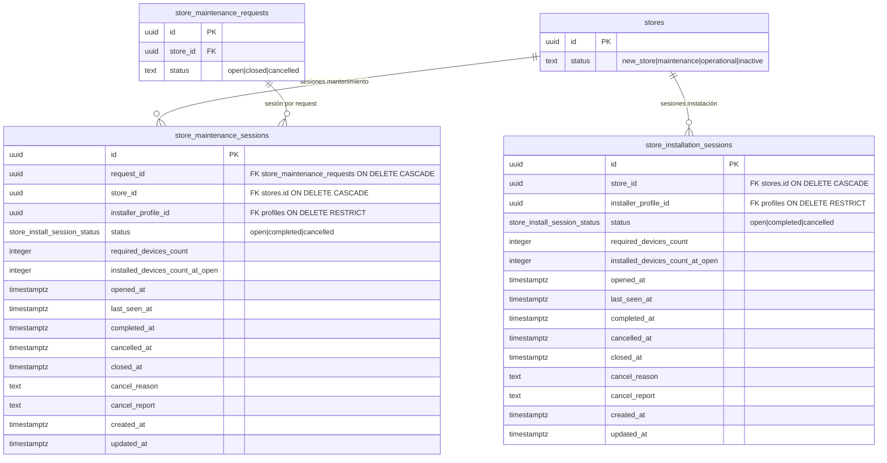
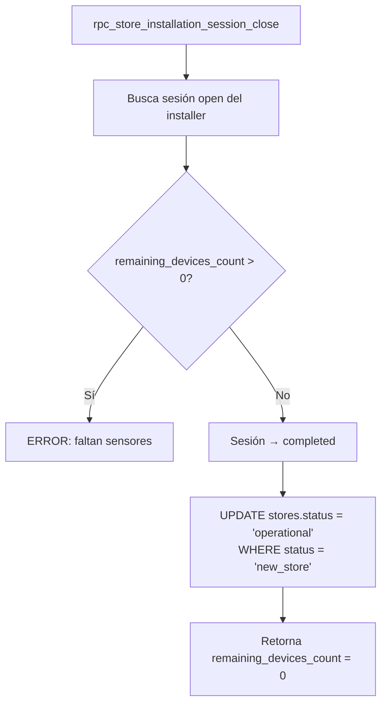
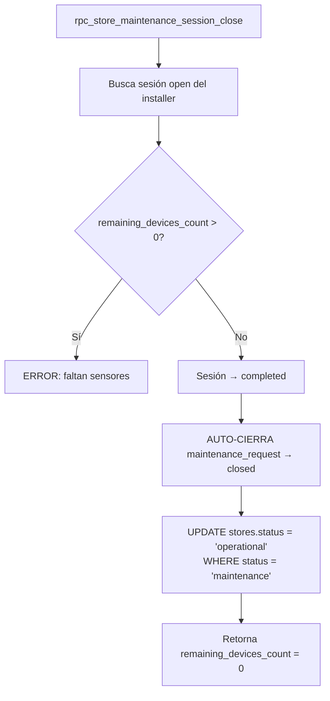
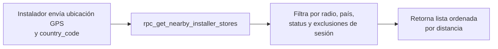
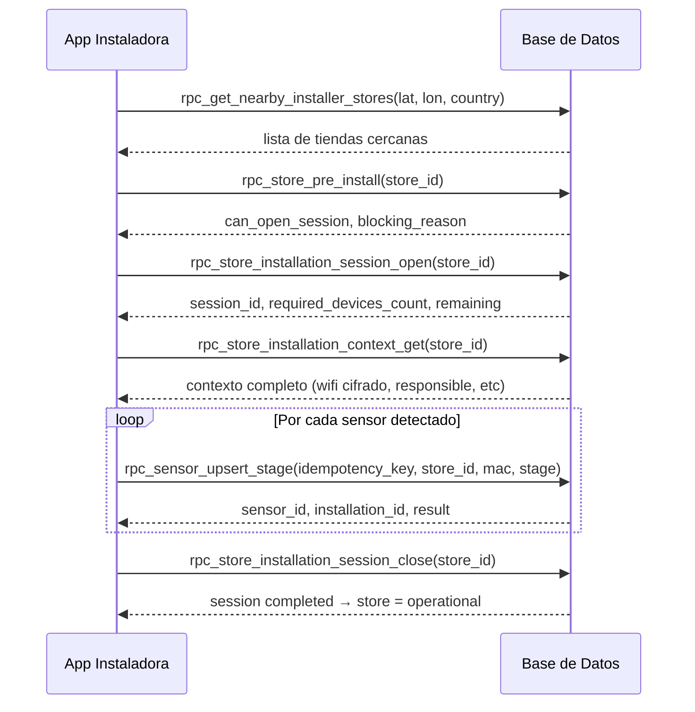

# Sessions

Las sesiones representan el contexto de trabajo activo de un instalador en una tienda. Existen dos tipos: **sesiones de instalación** (`store_installation_sessions`) y **sesiones de mantenimiento** (`store_maintenance_sessions`). Ambas comparten la misma restricción de exclusividad: un instalador no puede tener más de una sesión activa al mismo tiempo, de ningún tipo.

---

## Modelo de datos



---

## Enum `public.store_install_session_status`

| Valor | Descripción |
|---|---|
| `open` | Sesión activa en curso |
| `completed` | Completada exitosamente |
| `cancelled` | Cancelada (por el instalador, admin, o forzada) |

---

## Tabla `public.store_installation_sessions`

Sesión de trabajo del instalador para una instalación **inicial** de sensores en una tienda con `status = 'new_store'`.

### Columnas

| Columna | Tipo | Notas |
|---|---|---|
| `id` | `uuid` | PK |
| `store_id` | `uuid` | FK → `stores.id` ON DELETE CASCADE |
| `installer_profile_id` | `uuid` | FK → `profiles.user_id` ON DELETE RESTRICT |
| `status` | `store_install_session_status` | DEFAULT `'open'` |
| `required_devices_count` | `integer` | Número de sensores requeridos al momento de apertura |
| `installed_devices_count_at_open` | `integer` | Sensores instalados cuando se abrió la sesión |
| `opened_at` | `timestamptz` | Momento de apertura |
| `last_seen_at` | `timestamptz` | Última actividad (actualizado en reopen) |
| `completed_at` | `timestamptz` | Momento de completar |
| `cancelled_at` | `timestamptz` | Momento de cancelar |
| `closed_at` | `timestamptz` | Momento de cierre definitivo |
| `cancel_reason` | `text` | Razón breve de cancelación |
| `cancel_report` | `text` | Reporte detallado de cancelación |
| `created_at` / `updated_at` | `timestamptz` | |

### Constraints

| Constraint | Regla |
|---|---|
| `store_installation_sessions_required_devices_non_negative_chk` | `required_devices_count >= 0` |
| `store_installation_sessions_installed_devices_at_open_non_negative_chk` | `installed_devices_count_at_open >= 0` |
| `store_installation_sessions_cancel_reason_not_empty_chk` | `cancel_reason` no puede ser string vacío si no es NULL |
| `store_installation_sessions_cancel_report_not_empty_chk` | `cancel_report` no puede ser string vacío si no es NULL |

### Índices

| Índice | Tipo | Notas |
|---|---|---|
| `store_installation_sessions_open_store_uq` | UNIQUE parcial | `(store_id) WHERE status = 'open'` — solo una sesión open por tienda |
| `store_installation_sessions_store_status_idx` | btree | `(store_id, status, opened_at DESC)` |
| `store_installation_sessions_installer_status_idx` | btree | `(installer_profile_id, status, opened_at DESC)` |

**Regla crítica:** el índice único parcial garantiza que **solo puede haber una sesión de instalación abierta por tienda** en cualquier momento.

---

## Tabla `public.store_maintenance_sessions`

Sesión de trabajo del instalador para ejecutar un **mantenimiento** sobre una tienda. Siempre está vinculada a un `store_maintenance_requests` abierto.

| Columna | Tipo | Notas |
|---|---|---|
| `id` | `uuid` | PK |
| `request_id` | `uuid` | FK → `store_maintenance_requests.id` ON DELETE CASCADE |
| `store_id` | `uuid` | FK → `stores.id` ON DELETE CASCADE |
| `installer_profile_id` | `uuid` | FK → `profiles.user_id` ON DELETE RESTRICT |
| `status` | `store_install_session_status` | DEFAULT `'open'` |
| `required_devices_count` | `integer` | |
| `installed_devices_count_at_open` | `integer` | |
| `opened_at` / `last_seen_at` | `timestamptz` | |
| `completed_at` / `cancelled_at` / `closed_at` | `timestamptz` | |
| `cancel_reason` / `cancel_report` | `text` | |
| `created_at` / `updated_at` | `timestamptz` | |

### Índices clave

| Índice | Tipo | Notas |
|---|---|---|
| `store_maintenance_sessions_open_store_uq` | UNIQUE parcial | `(store_id) WHERE status = 'open'` |
| `store_maintenance_sessions_open_request_uq` | UNIQUE parcial | `(request_id) WHERE status = 'open'` |

---

## Reglas de exclusividad entre sesiones

```mermaid
flowchart TD
    A[Installer intenta abrir sesión\n(instalación o mantenimiento)] --> B{Ya tiene sesión install\nabierta en otra tienda?}
    B -- Sí --> ERR1[ERROR: ya tiene sesión\nen store X]
    B -- No --> C{Ya tiene sesión maintenance\nabierta en alguna tienda?}
    C -- Sí --> ERR2[ERROR: ya tiene sesión\nde mantenimiento en store X]
    C -- No --> D[Puede abrir sesión]
```

Un instalador puede tener **exactamente una sesión activa** (de cualquier tipo) en cualquier momento. Esta regla aplica tanto a `rpc_store_installation_session_open` como a `rpc_store_maintenance_session_open`.

---

## RPCs de Sesiones de Instalación

### `rpc_store_installation_session_open(p_store_id)`

Abre una nueva sesión de instalación o reanuda una existente del mismo instalador.

**Permisos:** `authenticated` (solo `installer`), `service_role`.

**Parámetros:** `p_store_id uuid` (requerido).

**Retorna:** `session_id`, `status`, `required_devices_count`, `current_installed_devices_count`, `remaining_devices_count`, `result`, `error`.

**Precondiciones:**
- La tienda debe existir y tener `status = 'new_store'`.
- `install_enabled = true`.
- No debe existir sesión de instalación `completed` previa.
- El instalador no debe tener otra sesión activa (install o maintenance) en otra tienda.

**Comportamiento:**
- Si ya existe una sesión `open` del mismo instalador → la reanuda (actualiza `last_seen_at`).
- Si existe sesión `open` de otro instalador → error.
- Si no hay sesión → crea una nueva.

---

### `rpc_store_installation_session_close(p_store_id, p_session_id?)`

Cierra la sesión de instalación. Si todos los sensores requeridos están instalados, la tienda pasa a `operational`.

**Permisos:** `authenticated` (solo `installer` dueño), `service_role`.

**Parámetros:**

| Parámetro | Tipo | Notas |
|---|---|---|
| `p_store_id` | `uuid` | Requerido |
| `p_session_id` | `uuid` | Opcional; si NULL busca la sesión open del installer |

**Lógica de cierre:**



**Restricciones frontend:**
- Solo el installer dueño de la sesión puede cerrarla.
- No se puede cerrar si aún faltan sensores por instalar.
- El store solo pasa a `operational` si antes estaba en `new_store`.

---

## RPCs de Sesiones de Mantenimiento

### `rpc_store_maintenance_session_open(p_store_id, p_request_id?)`

Abre una sesión de mantenimiento para el instalador asignado a la solicitud.

**Permisos:** `authenticated` (solo `installer`), `service_role`.

**Parámetros:**

| Parámetro | Tipo | Notas |
|---|---|---|
| `p_store_id` | `uuid` | Requerido |
| `p_request_id` | `uuid` | Opcional; si NULL usa la solicitud `open` más reciente |

**Retorna:** `session_id`, `status`, `required_devices_count`, `current_installed_devices_count`, `remaining_devices_count`, `result`, `error`.

**Precondiciones:**
- Debe existir una `store_maintenance_requests` con `status = 'open'` para la tienda.
- La tienda debe tener `status = 'maintenance'`.
- El instalador debe ser el `assigned_installer_profile_id` del request (o `assigned_installer_profile_id = NULL` si el request no tiene asignado).
- El instalador no debe tener otra sesión activa en otra tienda.

---

### `rpc_store_maintenance_session_close(p_store_id, p_session_id?)`

Cierra exitosamente la sesión de mantenimiento. Cuando se completa, **auto-cierra el request de mantenimiento** asociado y **restaura el store a `operational`** automáticamente. El admin NO necesita llamar `rpc_store_maintenance_close` por separado en el flujo normal.

**Permisos:** `authenticated` (solo `installer` dueño), `service_role`.

**Parámetros:**

| Parámetro | Tipo | Notas |
|---|---|---|
| `p_store_id` | `uuid` | Requerido |
| `p_session_id` | `uuid` | Opcional; si NULL usa la sesión open del installer |

**Retorna:** `session_id`, `status` (`completed`), `required_devices_count`, `current_installed_devices_count`, `remaining_devices_count`, `result`, `error`.

**Lógica de cierre:**



**Restricciones frontend:**
- Solo el installer dueño de la sesión puede cerrarla.
- Si `remaining_devices_count > 0`: **ERROR** `'cannot close maintenance session %: % sensors still required by contract'`. No se puede forzar el cierre con sensores pendientes; usar `rpc_store_maintenance_session_cancel` si es necesario abortar.
- El auto-cierre del request y la restauración del store son atómicos con el cierre de sesión.

---

### `rpc_store_maintenance_session_cancel(p_store_id, p_session_id?, p_cancel_reason, p_cancel_report, p_idempotency_key?)`

Cancela una sesión de mantenimiento abierta cuando el instalador no puede completar el trabajo. A diferencia de `rpc_store_maintenance_session_close`, **no cierra el request de mantenimiento** — la tienda permanece en `status = 'maintenance'` para que otro instalador pueda retomar.

**Permisos:** `authenticated` (solo `installer`), `service_role`.

**Parámetros:**

| Parámetro | Tipo | Requerido | Notas |
|---|---|---|---|
| `p_store_id` | `uuid` | **Sí** | |
| `p_session_id` | `uuid` | No | Si NULL, usa la sesión open del installer |
| `p_cancel_reason` | `text` | **Sí** | Razón breve de cancelación (no puede ser vacío) |
| `p_cancel_report` | `text` | **Sí** | Reporte detallado (no puede ser vacío) |
| `p_idempotency_key` | `text` | No | Para idempotencia |

**Retorna:** `session_id`, `status` (`cancelled`), `required_devices_count`, `current_installed_devices_count`, `remaining_devices_count`, `result`, `error`.

**Lógica:**
- La sesión pasa a `cancelled` con `cancel_reason` y `cancel_report`.
- Se inserta un `sensor_maintenance_actions` de tipo `maintenance_cancel_report` con el reporte.
- El request de mantenimiento permanece `open`; el store permanece en `maintenance`.
- El admin puede reasignar a otro instalador o cerrar el request manualmente.

**Restricciones frontend:**
- `p_cancel_reason` y `p_cancel_report` son **obligatorios**.
- Solo el installer dueño de la sesión puede cancelarla.

---

## RPC de Búsqueda Geoespacial

### `rpc_get_nearby_installer_stores(lat, lon, country_code, ...)`

Retorna tiendas cercanas a la posición del instalador que están disponibles para instalación o mantenimiento.

**Permisos:** `authenticated` (`owner`, `admin`, `installer`), `service_role`.

**Parámetros:**

| Parámetro | Tipo | Requerido | Default | Notas |
|---|---|---|---|---|
| `p_installer_latitude` | `float8` | **Sí** | — | Rango -90..90 |
| `p_installer_longitude` | `float8` | **Sí** | — | Rango -180..180 |
| `p_country_code` | `text` | **Sí** | — | ISO-3166 alpha-2 uppercase. Debe existir en `countries` con flag=1 |
| `p_radius_meters` | `integer` | No | `10000` | > 0 |
| `p_limit` | `integer` | No | `100` | 1..500 |
| `p_statuses` | `text[]` | No | `['new_store','maintenance']` | Filtro de status de tienda |
| `p_offset` | `integer` | No | `0` | Paginación |

**Retorna:** `store_id`, `name`, `address`, `google_maps_url`, `authorized_devices_count`, `status`, `install_enabled`, `distance_meters`, `latitude`, `longitude`.

**Filtros aplicados automáticamente:**
- Solo tiendas con `active = true`.
- Sin sesión de instalación `open` de **ningún instalador** (cualquier sesión open en esa tienda la excluye del listado, incluyendo la propia).
- Para tiendas en `maintenance`: solo visibles si tienen solicitud de mantenimiento `open` Y el instalador es el asignado (o `assigned_installer_profile_id = NULL`).
- Sin sesión de mantenimiento `open` de otro instalador (la propia sesión no bloquea la visibilidad).



**Restricciones frontend:**
- `country_code` debe pasarse como código de 2 letras mayúsculas válido.
- `p_limit` máximo 500.
- Las tiendas en `maintenance` solo aparecen si tienen request abierto asignado al installer (o sin asignar).
- Tiendas con **cualquier** sesión de instalación `open` (incluyendo la propia) **no aparecen** en el listado.
- Tiendas con sesión de mantenimiento `open` de otro instalador **no aparecen** en el listado.

---

## Diagrama de flujo completo: instalación inicial



---

## Cancelación automática de sesiones por el sistema

Las sesiones pueden ser canceladas automáticamente (con `cancel_reason` específico) en los siguientes contextos:

| Evento | `cancel_reason` | Sesiones afectadas |
|---|---|---|
| `rpc_admin_toggle_store_active(false)` con sensores activos | `'cierre_de_tienda'` | `store_installation_sessions` open |
| `rpc_admin_toggle_store_active(false)` sin sensores activos | `'cierre_de_tienda'` | `store_installation_sessions` y `store_maintenance_sessions` open |
| `rpc_admin_deactivate_user` con `p_close_active_sessions=true` | `'user_deactivated'` | `store_installation_sessions` y `store_maintenance_sessions` open del usuario |

---

## Restricciones globales para el frontend

| Acción | Rol requerido | Restricciones adicionales |
|---|---|---|
| Abrir sesión de instalación | `installer` | Store en `new_store`, `install_enabled = true`, sin sesiones activas paralelas |
| Cerrar sesión de instalación | `installer` (dueño) | Todos los sensores requeridos instalados |
| Abrir sesión de mantenimiento | `installer` | Store en `maintenance`, request abierto, installer asignado o sin asignar |
| Cerrar sesión de mantenimiento | `installer` (dueño) | Todos los sensores requeridos instalados; auto-cierra request y restaura store |
| Cancelar sesión de mantenimiento | `installer` (dueño) | `cancel_reason` y `cancel_report` obligatorios; request permanece open |
| Buscar tiendas cercanas | `owner`, `admin`, `installer` | `country_code` válido, coordenadas válidas |
| Tener 2 sesiones activas simultáneas | ❌ | Bloqueado por lógica de RPC |
| Acceso directo a tablas de sesiones | ❌ | RLS habilitado |
