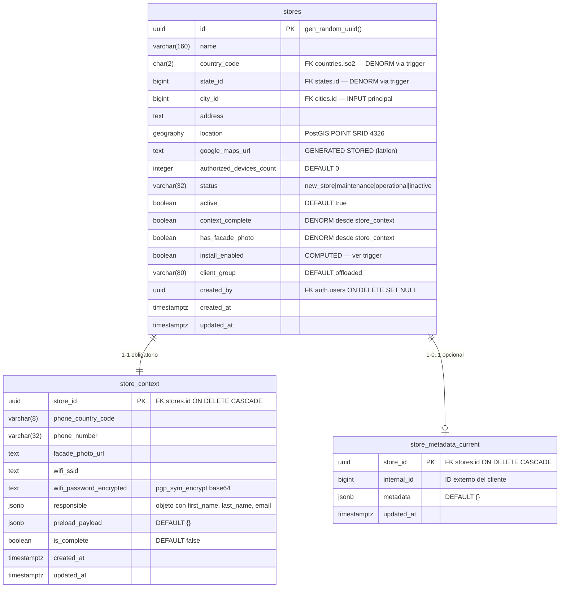
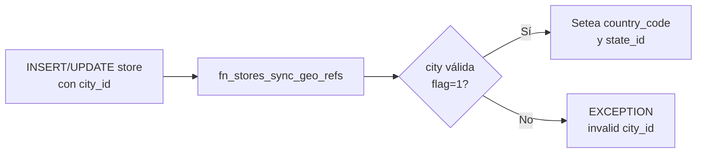
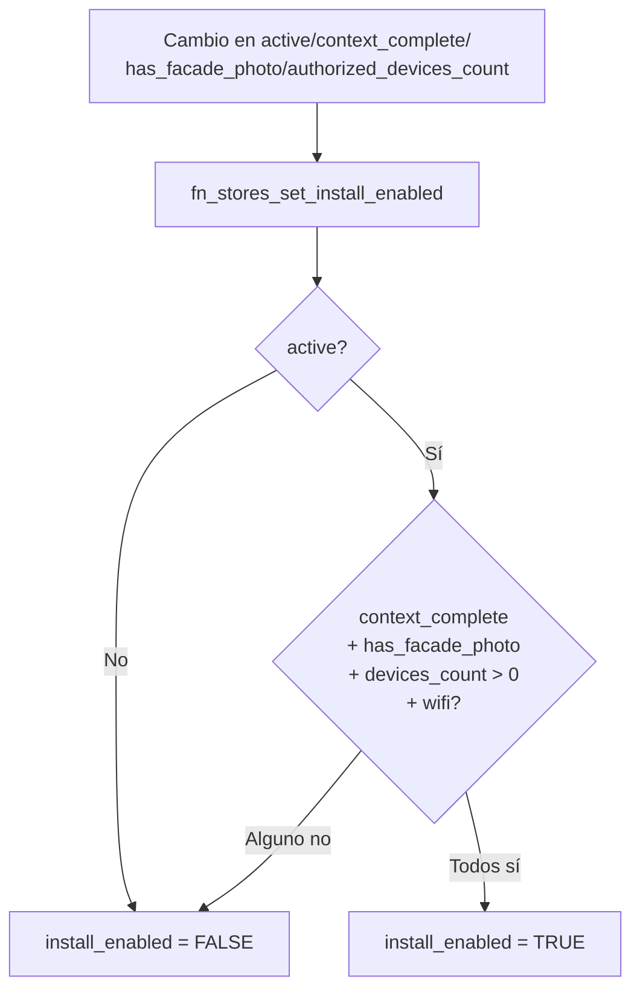
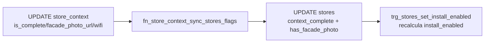
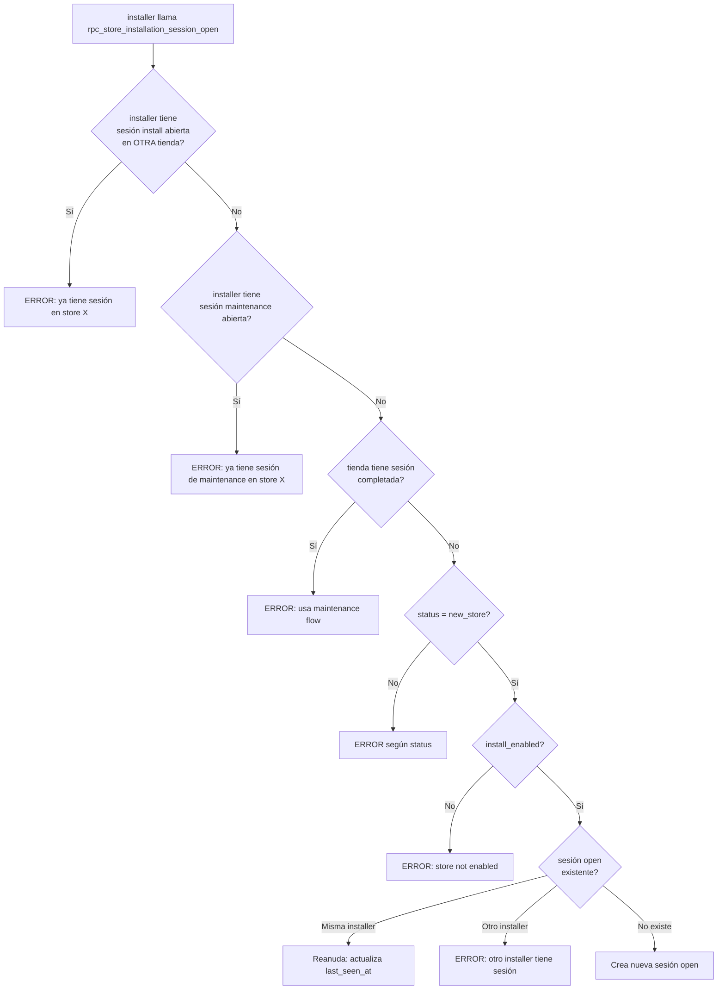
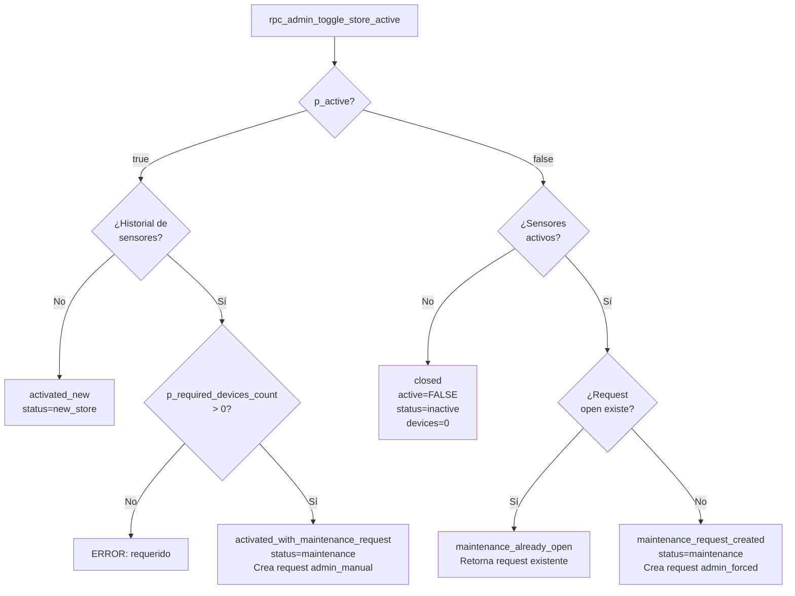
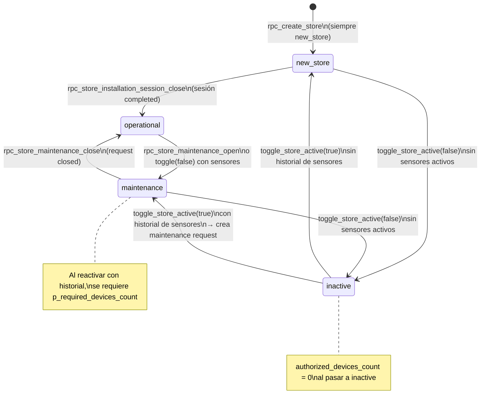

# Stores

El dominio de tiendas agrupa tres tablas relacionadas: `stores` (identidad y estado), `store_context` (datos operativos de instalación) y `store_metadata_current` (metadatos externos opcionales). Son el núcleo del sistema de instalación de sensores.

---

## Modelo de datos

---

## Tabla `public.stores`

Tabla principal de tiendas. Diseñada para acceso de alta frecuencia sin JOINs: todos los campos de listado y geolocalización están denormalizados.

### Columnas

| Columna | Tipo | Auto | Notas |
|---|---|---|---|
| `id` | `uuid` | `gen_random_uuid()` | PK |
| `name` | `varchar(160)` | — | Requerido, no puede ser solo espacios |
| `country_code` | `char(2)` | **Trigger** | Derivado de `city_id`. **No enviar directo.** |
| `state_id` | `bigint` | **Trigger** | Derivado de `city_id`. **No enviar directo.** |
| `city_id` | `bigint` | — | FK → `cities.id`. **Campo de entrada principal para geografía** |
| `address` | `text` | — | Requerido, no puede ser solo espacios |
| `location` | `geography(POINT,4326)` | — | Construido desde `latitude`/`longitude` en el RPC |
| `google_maps_url` | `text` | **GENERATED STORED** | `https://www.google.com/maps/search/?api=1&query=lat,lon` — no modificable |
| `authorized_devices_count` | `integer` | `0` | Cantidad contractual de sensores autorizados. No puede ser negativo |
| `status` | `varchar(32)` | `'new_store'` | Ver valores permitidos abajo |
| `active` | `boolean` | `true` | Si `false`, no se pueden instalar sensores |
| `context_complete` | `boolean` | **Trigger** | Derivado desde `store_context` |
| `has_facade_photo` | `boolean` | **Trigger** | Derivado desde `store_context.facade_photo_url` |
| `install_enabled` | `boolean` | **Trigger** | `active AND context_complete AND has_facade_photo AND authorized_devices_count > 0 AND wifi presente` |
| `client_group` | `varchar(80)` | `'offloaded'` | Grupo del cliente |
| `created_by` | `uuid` | — | FK → `auth.users` ON DELETE SET NULL |
| `created_at` | `timestamptz` | `NOW()` | |
| `updated_at` | `timestamptz` | `NOW()` | |

### Valores permitidos: `status`

| Valor | Descripción |
|---|---|
| `new_store` | Tienda nueva, pendiente de instalación inicial |
| `maintenance` | En mantenimiento activo |
| `operational` | Instalación completada exitosamente |
| `inactive` | Desactivada, sin operaciones |

### Constraints de integridad

| Constraint | Regla |
|---|---|
| `stores_name_not_empty` | `LENGTH(TRIM(name)) > 0` |
| `stores_country_code_format` | `country_code ~ '^[A-Z]{2}$'` |
| `stores_address_not_empty` | `LENGTH(TRIM(address)) > 0` |
| `stores_authorized_devices_count_non_negative` | `authorized_devices_count >= 0` |
| `stores_status_allowed` | solo `new_store`, `maintenance`, `operational`, `inactive` |
| `stores_client_group_not_empty` | `LENGTH(TRIM(client_group)) > 0` |

### Índices

| Índice | Tipo | Uso |
|---|---|---|
| `stores_location_gist_idx` | GIST | Búsquedas geoespaciales |
| `stores_country_status_active_idx` | btree | Filtros de listado |
| `stores_country_install_enabled_idx` | btree | Filtro install_enabled |
| `stores_install_enabled_idx` | btree (partial) | Solo donde `install_enabled = TRUE` |
| `stores_updated_at_idx` | btree DESC | Paginación por fecha |

---

## Tabla `public.store_context`

Datos operativos y de preload por tienda. **Siempre se crea junto con la tienda** y existe en relación 1-1 obligatoria.

| Columna | Tipo | Notas |
|---|---|---|
| `store_id` | `uuid` | PK y FK → `stores.id` ON DELETE CASCADE |
| `phone_country_code` | `varchar(8)` | Opcional |
| `phone_number` | `varchar(32)` | Opcional |
| `facade_photo_url` | `text` | URL de la foto de fachada. Debe ser no-vacío si se provee |
| `wifi_ssid` | `text` | SSID del WiFi de la tienda |
| `wifi_password_encrypted` | `text` | Contraseña encriptada con `pgp_sym_encrypt` + codificada en base64 |
| `responsible` | `jsonb` | Objeto con `first_name`, `last_name`, `email` (todos requeridos como claves). Puede incluir `phone_country_code`, `phone_number` |
| `preload_payload` | `jsonb` | DEFAULT `{}`. Datos de precarga del cliente |
| `is_complete` | `boolean` | DEFAULT `false`. Cuando `true` y hay WiFi, `context_complete` en `stores` se activa |
| `created_at` / `updated_at` | `timestamptz` | |

### Constraints

| Constraint | Regla |
|---|---|
| `store_context_responsible_is_object` | `jsonb_typeof(responsible) = 'object'` |
| `store_context_preload_payload_is_object` | `jsonb_typeof(preload_payload) = 'object'` |
| `store_context_responsible_required_keys` | El objeto `responsible` debe contener las claves `first_name`, `last_name`, `email` |
| `..._not_empty_chk` | `facade_photo_url`, `wifi_ssid`, `wifi_password_encrypted` no pueden ser strings vacíos si no son NULL |

---

## Tabla `public.store_metadata_current`

Metadatos externos opcionales. Solo se crea si el cliente provee `metadata` o `internal_id` al crear la tienda.

| Columna | Tipo | Notas |
|---|---|---|
| `store_id` | `uuid` | PK y FK → `stores.id` ON DELETE CASCADE |
| `internal_id` | `bigint` | ID externo del cliente para correlación de ingestión |
| `metadata` | `jsonb` | DEFAULT `{}`. Debe ser un objeto JSON |
| `updated_at` | `timestamptz` | |

**Índices:** GIN sobre `metadata` (jsonb_path_ops), btree sobre `internal_id` (parcial donde `internal_id IS NOT NULL`).

---

## Triggers

### `trg_stores_sync_geo_refs` → `fn_stores_sync_geo_refs()`

**Evento:** `BEFORE INSERT OR UPDATE OF city_id, state_id` en `stores`.

**Lógica:** Resuelve `country_code` y `state_id` consultando `cities → states → countries` (todos con `flag = 1`). Si `city_id` no existe o su cadena tiene `flag != 1`, lanza excepción.

---

### `trg_stores_set_install_enabled` → `fn_stores_set_install_enabled()`

**Evento:** `BEFORE INSERT OR UPDATE OF active, context_complete, has_facade_photo, authorized_devices_count` en `stores`.

**Lógica:** Calcula si la tienda está lista para instalar sensores. **`install_enabled = true`** solo cuando ALL se cumplen:
- `active = true`
- `context_complete = true`
- `has_facade_photo = true`
- `authorized_devices_count > 0`
- WiFi presente en `store_context` (`wifi_ssid` y `wifi_password_encrypted` no vacíos)

---

### `trg_store_context_sync_stores_flags` → `fn_store_context_sync_stores_flags()`

**Evento:** `AFTER INSERT OR UPDATE OF is_complete, facade_photo_url, wifi_ssid, wifi_password_encrypted` en `store_context`.

**Lógica:** Actualiza en `stores`:
- `context_complete` = `is_complete AND wifi_ssid no vacío AND wifi_password_encrypted no vacío`
- `has_facade_photo` = `facade_photo_url IS NOT NULL AND no vacío`

Esto a su vez dispara `trg_stores_set_install_enabled`.

---

## RPCs de Stores

### `rpc_create_store(...)`

Crea una tienda con su `store_context` y opcionalmente `store_metadata_current` en una sola transacción atómica.

**Permisos:** `authenticated` (solo `owner`/`admin`), `service_role`.

> **Nota:** `status` y `active` **no son parámetros**. Toda tienda creada es implícitamente `active = TRUE` y `status = 'new_store'`. El ciclo de vida posterior se gestiona exclusivamente con `rpc_admin_toggle_store_active`.

**Parámetros:**

| Parámetro | Tipo | Requerido | Notas |
|---|---|---|---|
| `p_name` | `text` | **Sí** | No puede ser vacío |
| `p_city_id` | `bigint` | **Sí** | Debe existir con flag=1 |
| `p_address` | `text` | **Sí** | No puede ser vacío |
| `p_latitude` | `float8` | **Sí** | Rango -90..90 |
| `p_longitude` | `float8` | **Sí** | Rango -180..180 |
| `p_responsible_first_name` | `text` | **Sí** | |
| `p_responsible_last_name` | `text` | **Sí** | |
| `p_responsible_email` | `text` | **Sí** | Validación de formato email |
| `p_phone_country_code` | `text` | No | |
| `p_phone_number` | `text` | No | |
| `p_responsible_phone_country_code` | `text` | No | |
| `p_responsible_phone_number` | `text` | No | |
| `p_authorized_devices_count` | `integer` | No | DEFAULT `0`, no negativo |
| `p_preload_payload` | `jsonb` | No | DEFAULT `{}`, debe ser objeto |
| `p_context_is_complete` | `boolean` | No | DEFAULT `false`. Si `true`, `preload_payload` no puede ser `{}` |
| `p_metadata` | `jsonb` | No | Objeto externo opcional |
| `p_created_by` | `uuid` | No | Debe existir en `auth.users` |
| `p_client_group` | `text` | No | DEFAULT `'offloaded'` |
| `p_internal_id` | `bigint` | No | ID externo del cliente |
| `p_facade_photo_url` | `text` | No | URL de fachada inicial |

**Retorna:** `store_id uuid`, `result boolean`, `error text`.

**Restricciones frontend:**
- Solo `owner` o `admin` pueden llamar este RPC desde el cliente autenticado.
- Si `p_context_is_complete = true` y `p_preload_payload = {}`, falla con error.
- `country_code` y `state_id` **no se pasan**: se derivan de `city_id` automáticamente.
- No pasar `p_active` ni `p_status`; son invariables en la creación.

---

### `rpc_store_set_facade_photo(p_store_id, p_facade_photo_url)`

Registra la URL de la foto de fachada de una tienda. Actualiza `store_context.facade_photo_url`, lo que propaga `has_facade_photo` en `stores` vía trigger.

**Permisos:** `authenticated` (solo `installer`), `service_role`.

**Parámetros:**

| Parámetro | Tipo | Requerido | Notas |
|---|---|---|---|
| `p_store_id` | `uuid` | **Sí** | Debe existir en `store_context` |
| `p_facade_photo_url` | `text` | **Sí** | No puede ser vacío |

**Retorna:** `store_id`, `has_facade_photo`, `install_enabled`, `result`, `error`.

**Restricciones frontend:**
- Solo `installer` puede llamar este RPC.
- La URL debe ser un string no vacío.

---

### `rpc_store_installation_context_get(p_store_id)`

Retorna el contexto completo de una tienda para la app instaladora: datos de la tienda, contexto (WiFi cifrado, responsible, preload), y sesión abierta si existe.

**Permisos:** `authenticated` (`owner`, `admin`, o `installer` con sesión abierta en esa tienda), `service_role`.

**Parámetros:**

| Parámetro | Tipo | Requerido |
|---|---|---|
| `p_store_id` | `uuid` | **Sí** |

**Retorna:** todos los campos de `stores` + `store_context` (incluyendo `wifi_password_encrypted` — cifrado) + datos de la sesión abierta si existe.

> **⚠️ Nota:** el campo `wifi_password_encrypted` retornado está **aún cifrado**. Para obtener la contraseña en texto plano, usar `rpc_store_wifi_credentials_get`.

**Restricciones frontend:**
- Un `installer` solo puede llamar este RPC si tiene una sesión de **instalación** `open` para esa tienda. Una sesión de **mantenimiento** NO es suficiente; en flujo de mantenimiento el installer debe obtener el contexto de la tienda por otros medios (`rpc_get_nearby_installer_stores` retorna los campos básicos).
- `owner`/`admin` pueden llamarlo libremente.

---

### `rpc_store_installation_context_update(p_store_id, ...)`

Actualiza campos de la tienda y su contexto de forma parcial (PATCH semántico). Solo actualiza los campos que se proveen.

**Permisos:** `authenticated` (`owner`, `admin`, o `installer` con sesión abierta), `service_role`.

**Parámetros principales:**

| Parámetro | Tipo | Notas |
|---|---|---|
| `p_store_id` | `uuid` | **Requerido** |
| `p_name` | `text` | Opcional; no se sobreescribe si NULL |
| `p_address` | `text` | Opcional |
| `p_city_id` | `bigint` | Opcional; si se cambia, recalcula country/state |
| `p_latitude` / `p_longitude` | `float8` | Deben proveerse juntos o ninguno |
| `p_phone_country_code` / `p_phone_number` | `text` | Opcionales |
| `p_responsible_first_name/last_name/email` | `text` | Opcionales |
| `p_wifi_ssid` / `p_wifi_password` | `text` | `wifi_password` se encripta antes de guardar |
| `p_preload_payload` | `jsonb` | Opcional |
| `p_context_is_complete` | `boolean` | Opcional |

**Retorna:** `store_id`, `context_complete`, `has_facade_photo`, `install_enabled`, `result`, `error`.

**Restricciones frontend:**
- Un `installer` solo puede llamar este RPC con una sesión abierta para la tienda.
- `lat`/`lon` deben pasarse juntos o ninguno; no se acepta solo uno.
- La contraseña WiFi se encripta internamente; el frontend nunca debe almacenarla en texto plano.

---

### `rpc_store_pre_install(p_store_id)`

Verifica si una tienda puede recibir una sesión de instalación. Retorna `can_open_session` y `blocking_reason` sin modificar estado.

**Permisos:** `authenticated` (solo `installer`), `service_role`.

**Parámetros:** `p_store_id uuid` (requerido).

**Retorna:**

| Campo | Tipo | Notas |
|---|---|---|
| `found` | `boolean` | Si la tienda existe |
| `city_id` | `bigint` | |
| `address` | `text` | |
| `store_status` | `text` | |
| `active` | `boolean` | |
| `context_complete` | `boolean` | |
| `install_enabled` | `boolean` | |
| `can_open_session` | `boolean` | `true` si el installer puede abrir sesión |
| `blocking_reason` | `text` | Razón de bloqueo si `can_open_session = false` |
| `maintenance_reason` | `text` | Razón del request de mantenimiento abierto, si existe (puede ser `NULL`) |

**Valores de `blocking_reason`:**

| Valor | Significado |
|---|---|
| `store_not_found` | La tienda no existe |
| `store_inactive` | `active = false` |
| `store_in_maintenance_use_maintenance_flow` | `status = 'maintenance'`; usar flujo de mantenimiento |
| `store_installation_already_completed` | Instalación ya completada (`status = 'operational'` o sesión `completed` existente) |
| `store_not_eligible_for_installation` | El store tiene status distinto a `new_store` (no es maintenance ni operational) |
| `store_not_enabled_for_installation` | `install_enabled = false` |
| `store_has_open_session_by_another_installer` | Otro instalador tiene sesión abierta |

---

### `rpc_store_wifi_credentials_get(p_store_id)`

Retorna el SSID y la contraseña WiFi **en texto plano** (descifrada internamente con la clave del servidor).

**Permisos:** `authenticated` (`owner`, `admin`, o `installer` con sesión abierta), `service_role`.

**Parámetros:** `p_store_id uuid` (requerido).

**Retorna:** `store_id`, `wifi_ssid`, `wifi_password_plain`.

**Restricciones frontend:**
- Un `installer` requiere sesión de instalación `open` para la tienda.
- La contraseña se retorna en texto plano **solo en este RPC**; no persistir del lado cliente.
- La clave de encriptación reside en `app.settings.wifi_encryption_key` en el servidor.

---

### `rpc_store_installation_session_open(p_store_id)`

Abre (o reanuda) una sesión de instalación para el instalador autenticado.

**Permisos:** `authenticated` (solo `installer`), `service_role`.

**Parámetros:** `p_store_id uuid` (requerido).

**Retorna:** `session_id`, `status`, `required_devices_count`, `current_installed_devices_count`, `remaining_devices_count`, `result`, `error`.

**Flujo:**

**Restricciones frontend:**
- Solo `installer` puede abrir sesiones de instalación.
- Un instalador no puede tener sesiones abiertas en múltiples tiendas simultáneamente (ni install ni maintenance).
- Si la tienda ya pasó a `operational`, debe usar el flujo de mantenimiento.
- La tienda debe tener `install_enabled = true` y `status = 'new_store'`.

---

### `rpc_store_installation_session_close(p_store_id, p_session_id?)`

Cierra una sesión de instalación. Si todos los sensores requeridos están instalados, marca la tienda como `operational`.

**Permisos:** `authenticated` (solo `installer`), `service_role`.

**Parámetros:**

| Parámetro | Tipo | Notas |
|---|---|---|
| `p_store_id` | `uuid` | Requerido |
| `p_session_id` | `uuid` | Opcional; si no se pasa, busca la sesión open del installer |

**Retorna:** `session_id`, `status` (`completed`), `required_devices_count`, `current_installed_devices_count`, `remaining_devices_count`, `result`, `error`.

**Lógica de cierre:**
- Si `remaining_devices_count > 0` → **ERROR**: `'cannot close session %: % sensors still required by contract'`. La sesión permanece `open`; el instalador debe instalar los sensores faltantes antes de cerrar.
- Si todos los sensores están instalados → sesión → `completed`, store → `operational` (si estaba en `new_store`).

**Restricciones frontend:**
- Solo el installer dueño de la sesión puede cerrarla (o `service_role`/admin de consola).
- La sesión debe estar en estado `open`.
- No se puede forzar el cierre con sensores pendientes; no existe parámetro de forzado en este RPC.

---

---

## RPCs Administrativos del Dashboard

### `rpc_admin_list_stores(...)`

Lista todas las tiendas con paginación, búsqueda, filtros y ordenamiento. Diseñado para el panel admin (no geoespacial).

**Permisos:** `authenticated` (`owner`, `admin`), `service_role`.

**Parámetros:**

| Parámetro | Tipo | Default | Notas |
|---|---|---|---|
| `p_page` | `int` | `1` | |
| `p_page_size` | `int` | `20` | Máx 100 |
| `p_search` | `text` | `NULL` | Busca en `name` y `address` (ILIKE) |
| `p_sort_by` | `text` | `'updated_at'` | `name`, `status`, `updated_at`, `city_name` |
| `p_sort_order` | `text` | `'desc'` | `'asc'` o `'desc'` |
| `p_filter_status` | `text[]` | `NULL` | Array de status a incluir |
| `p_filter_country_code` | `text` | `NULL` | ISO-3166 alpha-2 |
| `p_filter_active` | `boolean` | `NULL` | Filtro por campo `active` |

**Retorna (TABLE):**

| Campo | Tipo | Notas |
|---|---|---|
| `store_id` | `uuid` | |
| `name` | `text` | |
| `facade_photo_url` | `text` | De `store_context`, puede ser NULL |
| `status` | `text` | |
| `active` | `boolean` | |
| `install_enabled` | `boolean` | |
| `authorized_devices_count` | `int` | |
| `installed_devices_count` | `int` | Sensores con `current_status='installed'` y `is_active=true` |
| `city_name` | `text` | JOIN cities |
| `state_name` | `text` | JOIN states |
| `country_code` | `text` | |
| `google_maps_url` | `text` | |
| `phone_country_code` | `text` | De `store_context` |
| `phone_number` | `text` | De `store_context` |
| `last_visit_date` | `timestamptz` | MAX `opened_at` de sesiones install + maintenance |
| `total_count` | `bigint` | Total sin paginación (`COUNT(*) OVER()`) |

---

### `rpc_admin_map_list_stores(...)`

Listado geoespacial para mapa administrativo (Google Maps/Leaflet) con centro+radio, filtro por estados y paginación progresiva.

**Permisos:** `authenticated` (`owner`, `admin`), `service_role`.

**Parámetros:**

| Parámetro | Tipo | Default | Notas |
|---|---|---|---|
| `p_center_latitude` | `float8` | — | **Requerido**. Rango `-90..90` |
| `p_center_longitude` | `float8` | — | **Requerido**. Rango `-180..180` |
| `p_radius_meters` | `int` | `50000` | Radio de inclusión. Se aplica mínimo `100` y máximo efectivo `250000` |
| `p_statuses` | `text[]` | `['new_store','operational','maintenance','inactive']` | Estados permitidos del filtro |
| `p_limit` | `int` | `300` | Máx `1000` por página |
| `p_offset` | `int` | `0` | Paginación offset |
| `p_country_code` | `text` | `NULL` | Opcional. Si se envía, debe ser ISO-3166 alpha-2 válido |

**Retorna (TABLE):**

| Campo | Tipo | Notas |
|---|---|---|
| `store_id`, `name`, `address`, `google_maps_url` | varios | Datos básicos de marker |
| `authorized_devices_count` | `int` | Capacidad contractual |
| `status`, `active`, `install_enabled` | varios | Estado operativo de la tienda |
| `country_code`, `city_name`, `state_name` | varios | Contexto geográfico |
| `distance_meters`, `latitude`, `longitude` | varios | Posición y distancia al centro consultado |
| `has_open_install_session` | `boolean` | Si hay sesión de instalación abierta |
| `has_open_maintenance_session` | `boolean` | Si hay sesión de mantenimiento abierta |
| `has_more` | `boolean` | Indica si hay más páginas para cargar |
| `effective_radius_meters` | `int` | Radio realmente aplicado tras clamp |
| `radius_clamped` | `boolean` | `true` si el radio solicitado fue recortado por protección |

**Notas de performance para mapa:**
- Evita `COUNT(*) OVER()` para no escanear todo el universo cuando el radio es grande.
- Usa patrón `LIMIT + 1` para calcular `has_more` y soportar carga incremental fluida.
- Mantiene guardrails server-side (`radius` y `limit`) para evitar consultas explosivas.

---

### `rpc_admin_map_store_clusters(...)`

Devuelve clusters de tiendas para el mapa admin usando `viewport + zoom`. Está pensado para zoom bajo/medio, donde miles de markers individuales degradan rendimiento.

**Permisos:** `authenticated` (`owner`, `admin`), `service_role`.

**Parámetros:**

| Parámetro | Tipo | Default | Notas |
|---|---|---|---|
| `p_min_latitude` | `float8` | — | **Requerido** |
| `p_min_longitude` | `float8` | — | **Requerido** |
| `p_max_latitude` | `float8` | — | **Requerido** |
| `p_max_longitude` | `float8` | — | **Requerido** |
| `p_zoom` | `int` | `10` | Se clamp a `0..22` |
| `p_statuses` | `text[]` | `['new_store','operational','maintenance','inactive']` | Filtro de estados |
| `p_limit` | `int` | `500` | Máx `2000` clusters por página |
| `p_offset` | `int` | `0` | Paginación de clusters |
| `p_country_code` | `text` | `NULL` | Opcional, ISO-3166 alpha-2 |

**Retorna (TABLE):**

| Campo | Tipo | Notas |
|---|---|---|
| `cluster_key` | `text` | Id estable del cluster (`z:tile_x:tile_y`) |
| `cluster_zoom` | `int` | Zoom efectivo usado para tileado |
| `tile_x`, `tile_y` | `bigint` | Coordenadas de tile Web Mercator |
| `cluster_latitude`, `cluster_longitude` | `float8` | Centroide del cluster (`AVG(lat)`, `AVG(lon)` de las tiendas agrupadas) |
| `stores_count` | `int` | Total de tiendas en el cluster |
| `new_store_count`, `operational_count`, `maintenance_count`, `inactive_count` | `int` | Conteos por estado |
| `sample_store_ids` | `uuid[]` | Hasta 3 tiendas de referencia |
| `has_more` | `boolean` | Si hay más clusters para paginar |
| `effective_limit` | `int` | Límite aplicado tras clamp |

**Estrategia de consumo frontend recomendada:**
- `zoom <= 11`: usar `rpc_admin_map_store_clusters`.
- `zoom >= 12`: usar `rpc_admin_map_list_stores` (puntos individuales).
- Al cambiar viewport (pan/zoom), aplicar debounce (`300-500ms`) y recargar página 0.

---

### `rpc_admin_get_store_detail(p_store_id)`

Detalle completo de una tienda para la vista admin, incluyendo datos de contexto, metadata, conteo de dispositivos y sesión abierta si existe.

**Permisos:** `authenticated` (`owner`, `admin`), `service_role`.

**Parámetros:** `p_store_id uuid` (requerido).

**Retorna (RECORD):**

| Campo | Fuente | Notas |
|---|---|---|
| Todos los campos de `stores` | `stores` | |
| `phone_country_code`, `phone_number`, `facade_photo_url`, `wifi_ssid`, `responsible`, `preload_payload`, `is_complete` | `store_context` | **Sin `wifi_password`** — usar `rpc_store_wifi_credentials_get` |
| `internal_id`, `metadata` | `store_metadata_current` | Puede ser NULL |
| `installed_devices_count` | Calculado | COUNT sensores instalados activos |
| `total_sessions_count` | Calculado | Total sesiones install + maintenance |
| `open_session_id` | Calculado | UUID de sesión abierta o NULL |
| `open_session_type` | Calculado | `'install'`, `'maintenance'` o NULL |
| `open_session_installer_name` | Calculado | `first_name || ' ' || last_name` del instalador |

---

### `rpc_admin_update_store(...)`

Actualiza campos administrativos de una tienda de forma parcial (PATCH semántico). Solo actualiza los campos explícitamente pasados.

> **Nota:** `p_active` no es un parámetro de este RPC. La activación/desactivación se gestiona exclusivamente con `rpc_admin_toggle_store_active`.

**Permisos:** `authenticated` (`owner`, `admin`), `service_role`.

**Parámetros:**

| Parámetro | Tipo | Requerido | Notas |
|---|---|---|---|
| `p_store_id` | `uuid` | **Sí** | |
| `p_name` | `text` | No | Se ignora si NULL o vacío |
| `p_address` | `text` | No | Se ignora si NULL o vacío |
| `p_city_id` | `bigint` | No | Recalcula `country_code`/`state_id` vía trigger |
| `p_latitude` | `float8` | No | Debe pasarse junto con `p_longitude` |
| `p_longitude` | `float8` | No | Debe pasarse junto con `p_latitude` |
| `p_authorized_devices_count` | `int` | No | No negativo |
| `p_status` | `text` | No | Uno de `new_store`, `maintenance`, `operational`, `inactive` |
| `p_client_group` | `text` | No | Se ignora si NULL o vacío |

**Retorna:** `store_id uuid`, `result boolean`, `error text`.

---

### `rpc_admin_toggle_store_active(p_store_id, p_active, p_required_devices_count?)`

Gestiona el ciclo de vida de activación/desactivación de una tienda con lógica de negocio completa. Es el **único RPC** que modifica `stores.active`.

**Permisos:** `authenticated` (`owner`, `admin`), `service_role`.

**Parámetros:**

| Parámetro | Tipo | Requerido | Notas |
|---|---|---|---|
| `p_store_id` | `uuid` | **Sí** | |
| `p_active` | `boolean` | **Sí** | `true` = activar, `false` = cerrar |
| `p_required_devices_count` | `int` | Condicional | Obligatorio y > 0 al activar una tienda con historial de sensores |

**Retorna:**

| Campo | Tipo | Notas |
|---|---|---|
| `store_id` | `uuid` | |
| `action_taken` | `text` | Ver tabla de acciones abajo |
| `maintenance_request_id` | `uuid` | UUID de la solicitud creada o existente (puede ser NULL) |
| `sensors_pending` | `int` | Sensores activos al momento del cierre |
| `result` | `boolean` | |
| `error` | `text` | NULL si éxito |

**Acciones posibles (`action_taken`):**

| Valor | Condición | Efecto |
|---|---|---|
| `activated_new` | `p_active=true` + tienda sin historial de sensores | `active=TRUE`, `status='new_store'` |
| `activated_with_maintenance_request` | `p_active=true` + tienda con historial de sensores | `active=TRUE`, `status='maintenance'`, `authorized_devices_count=p_required_devices_count`; crea `store_maintenance_requests` con `cause='admin_manual'` |
| `maintenance_already_open` | `p_active=false` + hay sensores activos + ya existe request abierto | No modifica nada; retorna el request existente |
| `maintenance_request_created` | `p_active=false` + hay sensores activos + sin request abierto | `status='maintenance'`; cancela sesiones install abiertas; crea `store_maintenance_requests` con `cause='admin_forced'`, `force_open=true` |
| `closed` | `p_active=false` + sin sensores activos | `active=FALSE`, `status='inactive'`, `authorized_devices_count=0`; cancela todas las sesiones y solicitudes abiertas |

**Flujo de decisión:**

**Restricciones frontend:**
- `p_required_devices_count` es obligatorio al reactivar una tienda que ya tuvo sensores alguna vez.
- No se puede forzar el cierre si hay sensores físicamente instalados; se debe esperar que el instalador los retire mediante el flujo de mantenimiento.
- Al cerrar con `action_taken='closed'`, todas las sesiones abiertas (install y maintenance) y solicitudes de mantenimiento abiertas son canceladas automáticamente.

---

### `rpc_admin_list_store_sessions(p_store_id, p_page?, p_page_size?, p_session_type?)`

Lista todas las sesiones (instalación y mantenimiento) de una tienda con paginación.

**Permisos:** `authenticated` (`owner`, `admin`), `service_role`.

**Parámetros:**

| Parámetro | Tipo | Default | Notas |
|---|---|---|---|
| `p_store_id` | `uuid` | **Requerido** | |
| `p_page` | `int` | `1` | |
| `p_page_size` | `int` | `20` | |
| `p_session_type` | `text` | `NULL` | `'install'`, `'maintenance'`, o NULL para ambos |

**Retorna (TABLE):**

| Campo | Tipo | Notas |
|---|---|---|
| `session_id` | `uuid` | |
| `session_type` | `text` | `'install'` o `'maintenance'` |
| `status` | `text` | `open`, `completed`, `cancelled` |
| `installer_name` | `text` | `first_name || ' ' || last_name` |
| `installer_profile_id` | `uuid` | |
| `opened_at` | `timestamptz` | |
| `closed_at` | `timestamptz` | |
| `required_devices_count` | `int` | |
| `installed_devices_at_open` | `int` | |
| `total_count` | `bigint` | |

---

### `rpc_admin_list_store_sensors(p_store_id, p_page?, p_page_size?, p_include_historical?, p_filter_firmware_version?, p_filter_hardware_version?)`

Lista sensores asignados a una tienda, actualmente o en el historial.

**Permisos:** `authenticated` (`owner`, `admin`), `service_role`.

**Parámetros:**

| Parámetro | Tipo | Default | Notas |
|---|---|---|---|
| `p_store_id` | `uuid` | **Requerido** | |
| `p_page` | `int` | `1` | |
| `p_page_size` | `int` | `50` | |
| `p_include_historical` | `boolean` | `false` | Si `false`: solo sensores en `sensors.current_store_id`. Si `true`: todos los `sensor_installations` de la tienda |
| `p_filter_firmware_version` | `text` | `NULL` | Si se envía, solo `v1` o `v2` |
| `p_filter_hardware_version` | `text` | `NULL` | Si se envía, solo `v1` o `v2` |

**Retorna (TABLE):**

| Campo | Tipo | Notas |
|---|---|---|
| `sensor_id` | `uuid` | |
| `serial` | `text` | `ARX...` |
| `mac_normalized` | `text` | |
| `firmware_version` | `text` | `v1` o `v2` |
| `hardware_version` | `text` | `v1` o `v2` |
| `current_status` | `sensor_install_status` | |
| `is_active` | `boolean` | |
| `installed_at` | `timestamptz` | |
| `installer_name` | `text` | Primer instalador de la instalación activa/histórica |
| `total_count` | `bigint` | |

**Uso dashboard/frontend:**
- Este RPC ya expone las versiones para pintar tags `FW`/`HW` por fila.
- Para tabs de "Actuales" e "Histórico", reutilizar el mismo RPC variando `p_include_historical`.
- Para filtros de versión, enviar `NULL` cuando no haya filtro.

---

## Diagrama de estados de `stores.status`

---

## Restricciones globales para el frontend

| Acción | Rol requerido | Restricciones adicionales |
|---|---|---|
| Crear tienda | `owner`, `admin`, `service_role` | `status='new_store'` y `active=TRUE` son fijos; no configurables |
| Listar tiendas (admin) | `owner`, `admin` | |
| Ver detalle (admin) | `owner`, `admin` | Sin contraseña WiFi descifrada |
| Actualizar campos admin | `owner`, `admin` | No incluye `active` — usar toggle |
| Activar/desactivar tienda | `owner`, `admin` | Lógica de negocio compleja con sensores y maintenance requests |
| Listar sesiones de tienda | `owner`, `admin` | |
| Listar sensores de tienda | `owner`, `admin` | |
| Actualizar contexto | `owner`, `admin`, `installer` (con sesión) | `installer` requiere sesión open |
| Obtener contexto completo | `owner`, `admin`, `installer` (con sesión) | |
| Obtener WiFi en plano | `owner`, `admin`, `installer` (con sesión) | Solo vía `rpc_store_wifi_credentials_get` |
| Subir foto de fachada | `installer` | Cualquier installer autenticado |
| Abrir sesión instalación | `installer` | store `new_store` + `install_enabled`, sin sesiones activas en otras tiendas |
| Cerrar sesión instalación | `installer` | Solo dueño de la sesión |
| Acceso directo a tablas | ❌ | RLS habilitado, sin políticas directas definidas |
